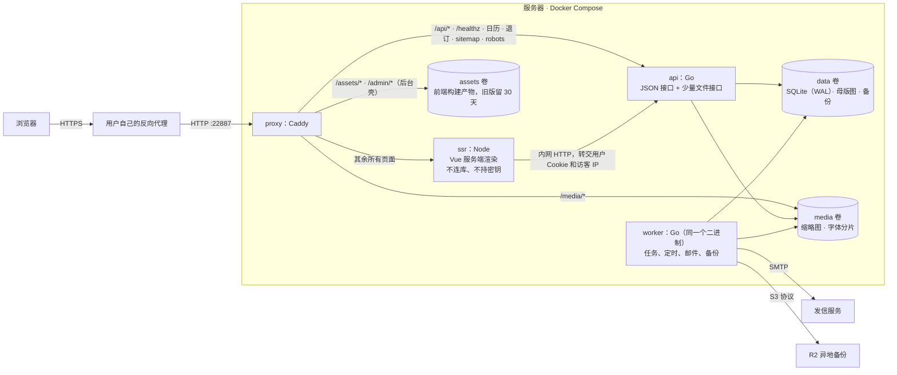

# SJTU-OW 设计文档 v8.0 草案：Vue 3 + Go 新栈

| 项目 | 内容 |
|---|---|
| 版本 | v8.0 **草案**（还没有生效） |
| 日期 | 2026-10-07（221 轮） |
| 状态 | 草案。**割接前，现行站以 `docs/design.md`（v7.22）为准**；这份只描述新栈 |
| 基于 | `docs/design.md` v7.22（行为和规则）、`docs/rewrite-research/12-architecture.md`（架构和实现规格）、220 轮五个实验的结果 |
| 谁来读 | 用户（拍板）、写新栈的人、割接时把它合进 `design.md` 的人 |

---

## 0. 这份文档怎么用

**为什么不直接改 `design.md`**：硬规则 1 说「先改设计、再改代码」，但新栈要写一百多轮才割接。这期间线上跑的还是 Django 站，`design.md` 要继续描述它，而且有测试钉着设计里的数字（附录 C、章节引用）。直接把第 2、13.13、16、17 章改成新栈，设计和现行代码就对不上了，两头都说不清。所以新栈的设计写在这里。

**分工**：

| 文件 | 管什么 |
|---|---|
| `docs/design.md` | 现行站（Django）的设计。割接前只在修现行站时改；割接后按第 8 节合并，版本 v8.0 |
| `docs/design-next.md`（本文） | 新栈**要成为什么样**：架构、不变量、哪些章节怎么变、新规则。新栈的设计变化先改这里 |
| `docs/rewrite-research/12-architecture.md` | 新栈**怎么做**：每个模块的实现规格、选型理由、里程碑。设计层面的结论写在本文，实现细节留在 12 号文档 |
| `docs/rewrite-research/00`–`11`、`13` | 调研和证据（路由、模型、237 条业务规则、基础设施、前端、契约、未决问题）。重写每个里程碑的验收清单来自这里 |
| `handoff/STATUS.md` | 进度（只写这里） |

**生效方式**：割接那一轮（M11）把第 8 节的清单做完，`design.md` 升到 v8.0，本文删除，附录 D 记一行。割接前新栈的任何设计变化，先改本文，再在附录里记一行（见本文第 9 节「变更记录」）。

**不变的东西**（硬规则）：新栈上线后，**地址、视觉、文案、237 条业务规则一个都不变**。设计里没写「要变」的地方，就是照旧。

---

## 1. 为什么重写

用户 2026-10-07 说「开始重构吧」，目标是前端 Vue 3、后端 Go。调研（`docs/rewrite-research/`）的结论是现行站能继续用，但有几类问题是 Django + Wagtail + 预渲染这个组合带来的、很难在现有结构里根治：

- **预渲染的一致性**：下线的内容、改了隐私的页面，静态文件最长留到第二天（04-2、08-2）；失效逻辑本身有竞态
- **第二套登录入口、第二套用户管理**：Wagtail 自带的登录页绕过了 allauth 的限流和邮箱验证（04-1，已在 218 补上），`/wagtail/users/` 绕过账号服务（04-3 至 04-5）
- **图片管线分散**：头像一套、队标一套、Wagtail 表单一套（07-1、02-1，已在 219 统一）
- **保存时联网占着写锁**（15-2）、**数据库缓存会清掉限流计数**（13-1）这类 Django 特有机制引出的问题
- **两个进程共用一个 SQLite 的并发纪律**靠写事务里的二次检查，没有统一入口

新栈的做法：业务真相只在 Go 的服务层；页面每次现渲染（不预渲染、不缓存 HTML）；每个接口在一张注册表里声明门和限流，路由、前端调用、守门测试都从注册表生成。

---

## 2. 已拍板的决定

| 编号 | 决定 | 选的 | 日期 | 备注 |
|---|---|---|---|---|
| D1 | 公开页怎么渲染 | **薄 SSR**：自己写的 Node 服务，无状态、不连库、不持密钥、不缓存 HTML | 10-07，用户 | 改了现行设计 2.1「不依赖 Node」；不用 Nuxt（CSP 要放宽到 nonce） |
| D2 | 「没有脚本时照旧能提交」（现行设计 13.7、13.17） | **阅读不靠脚本，动作要脚本**；脚本没加载上有横幅 | 10-07，用户 | 登录、注册、报名这类动作需要脚本；页面内容、导航、阅读都不需要。横幅用纯 CSS 8 秒后出现（220 轮 E1 验证） |
| D3 | 代码放哪 | **同仓库**加 `server/`、`web/`、`e2e/`，割接后删 Django 代码 | 10-07，用户 | 文档、进度、轮次记录保持「一件事只写一处」 |
| D4 | 字体库（运行时 TTF 切片） | 已切好的字体和排版设置原样搬；新字体用仓库里的离线工具（fontTools）切好后上传成品包，Google Fonts 来源由 Go 下载 | 10-07，用户 | 生产里没有 Python；上传自己的 TTF 要多一步 |
| D5 | AI 巡查 | 割接后再移植 | 按 12 号文档推荐 | 现在密钥没填、巡查空转；审核记录照常导入；割接前新站的后台只读显示 |
| D6 | 镜像在哪构建 | CI 构建推 GHCR，服务器只 `pull` | 按 12 号文档推荐 | 正式站要放一个只读令牌；构建缓存不再吃磁盘（183、186） |
| D7 | 文章修订历史 | 只搬「已发布那份」和「最新草稿」，完整历史留在旧库的存档备份里 | 按 12 号文档推荐 | 全搬要处理 v6.70 以前 StreamField 格式的旧修订（01-8） |
| D8 | staging 怎么给干部试用 | 给测试机配一个子域名，经用户的反代转过去 | **还没问** | 检查点 B 之前要用户配 |
| D9 | 割接时间 | 避开考试周和大型赛事报名期 | **还没问** | 停机预估由第二次演练给出 |
| D10 | 前台没做完就割接了怎么办 | **回滚到旧站**，新前台在测试机上做到和旧站对拍全绿再割接 | 10-10，用户 | 259 割接、265 回滚；要求和验收方法见 `docs/frontend-migration.md` |
| D11 | 新依赖 | SortableJS、CodeMirror 6、vue-tsc、Playwright | 10-10，用户 | 都是 MIT 或 Apache-2.0 |
| D12 | 后台形态 | 独立 SPA（`apps/admin`，Caddy 直接给 `index.html`） | 10-10，用户 | 12 号 6.8 原样 |
| D13 | 对拍截图的像素差上限 | 0.5% | 10-10，用户 | `e2e/parity/parity.py` 的 `RATIO_MAX` |

不需要拍板、按默认走的：数据库继续 SQLite；全部纯 Go、不用 cgo（WebP 慢了会换回，见 12 号文档 5.13）；视觉和地址 100% 不变；217 的两条高先在现行站修（已在 218、219 修完）。

---

## 3. 架构（替换现行设计 2.1–2.4）

- **四个服务**：`proxy`（Caddy，照旧）、`api`（Go，全部 JSON 接口）、`worker`（同一个 Go 二进制，任务队列、定时器、邮件、备份）、`ssr`（Node，只负责把 Go 给的数据画成 HTML）。
- **业务数据全部在一个 SQLite 文件里**，任务队列也在里面；一个写者纪律（第 4 节第 2、3 条）。
- **公开页面每次请求现渲染**，没有预渲染目录、没有插槽、没有「已登录」提示 Cookie、没有片段接口。登录状态在服务端渲染时就是确定的。
- **不依赖 Redis、PostgreSQL 等外部服务**；比现行设计 2.1 多了一个无状态的 Node 容器（决定 D1）。
- 选型（语言、路由、驱动、查询、迁移、邮件、图片、Markdown、前端、测试工具）和各自的许可证见 12 号文档第 4 节；**许可证规则不变**（MIT、BSD、Apache-2.0、ISC，GPL/AGPL 不行，开发工具也一样，所以不用 golangci-lint）。
- 一次请求怎么走（访客看页、登录用户看页、提交入队申请、后台自动保存）见 12 号文档 3.3；Caddy 的路由表见 3.4。

---

## 4. 架构不变量

新栈在任何选型下都要成立的规矩，每条都要有「拆掉就会红」的测试（硬规则 7）。大部分来自现行站踩过的坑（括号里是 217 复核的编号）。

1. **业务真相只有一处：Go 的服务层。** 状态字段只能经服务函数改。渲染进程（Node）不连数据库、不持有密钥、不做权限判断。
2. **一个 SQLite 文件、一个写者。** 写事务是「对 `<库>.wlock` 拿 `flock` → `BEGIN IMMEDIATE` → 提交 → 放锁」（220 轮 E3：只靠 `busy_timeout` 的忙等不公平，极端压力下会在 5 秒后报 busy；加了 `flock` 后零失败）。**写事务里不联网、不解码图片、不做任何可能超过 100 毫秒的事**，有看门狗，测试里超过 1 秒直接失败（15-2）。
3. **任务和业务写在同一个事务里入队**，要么都成、要么都不成。
4. **公开页面不预渲染、不缓存 HTML。** 下线、转私密的内容在提交的那一刻就不可见（04-2、08-2）。
5. **每个接口都在注册表里声明**：方法、路径、谁能用、限流、请求和响应类型、查询预算。路由、前端调用代码、守门测试、乱填测试都从注册表生成（把现行站的 `placed()` 和「每个后台地址都过门」推广到全站）。
6. **登录入口全站唯一**，所有登录路径共用同一套邮箱验证门和限流（04-1；现行站已在 v7.21 做到）。
7. **所有上传走同一条管线**：先读图头查像素再解码、解码失败即拒、重新编码去掉 EXIF 和 GPS、原图不公开、每日次数配额、替换时删旧文件（07-1、07-2、07-3、02-1、02-2、02-4；现行站已在 v7.22 做到）。
8. **每个可编辑的对象带版本号**，「同一个人在另一个标签页」也算并发；每个写请求可带幂等键，回执丢了重试能拿到原回执（11-2、12-2、05-1、06-2）。
9. **限流计数单独一张表**，不跟任何缓存共用淘汰策略；IPv6 按 /64 聚合（13-1、13-2）。
10. **定时任务在 worker 里按 `Asia/Shanghai` 显式计算**，不靠宿主 cron、不按某地夏令时换算（09-9；现行站已在 v7.21 用 `at-shanghai.sh` 过渡）。
11. **CSP 不放松**：前台 `script-src 'self'`，零内联脚本、零内联样式属性；后台也按同一标准（后台编辑器挂进 ShadowRoot，见第 6 节）。
12. **地址、视觉、文案不变。** 现有地址（含 `/accounts/login/` 这类）一个不改；`c-*`/`l-*`/`b-*` 样式原样搬；现行设计 13.2 继续有效。
13. **依赖只收宽松许可证**，新增依赖先问（硬规则 5 不变）。

---

## 5. 章节对照：`design.md` 的每一章在新设计里怎么办

「保留」是行为不变，「重写」是机制变了（行为还是原来的），「替换」是整章换成新栈的内容，「删除」是新栈里没有这个东西。

| 现行章节 | 去向 | 说明 |
|---|---|---|
| 1 项目概述 | 保留 | 术语表加「新栈」「注册表」「渲染进程」 |
| 2.1–2.4 架构、选型、应用划分、目录 | **替换** | 换成本文第 3 节和 12 号文档第 4、5.1、6.1 节 |
| 3 账号与个人资料 | 重写机制 | 行为不变。会话是服务端存的 Cookie；没有 CSRF 令牌（`http.CrossOriginProtection` + `SameSite=Lax` + 只收 JSON）；密码哈希认 Django 的 Argon2 和 PBKDF2，登录后升级；邮箱验证码只存哈希（12 号文档 5.7） |
| 4 角色与权限 | 重写机制 | 「交大用户」「校外用户」「投稿者」改为**派生角色**，不再是可编辑的组（消掉 10-1、04-4 这一类）；管理角色只有四个，存 `user_roles`；`can_use` 照旧是唯一的功能门（12 号文档 5.8） |
| 5 内容与投稿 | 重写机制 | 页面和修订、定时发布自己建表（`pages`、`page_revisions`），页面编号沿用 Wagtail 的；Markdown 渲染换成 goldmark（对拍通过，见 12 号文档 5.12）；AI 审核割接后移植（D5）；评论照旧（v7.21 的「先查文章是否公开」写进注册表的声明） |
| 6 成员展示 | 保留 | |
| 7 战队、8 赛事、9 内战 | 保留 | 状态机、名额、分队算法的规则和测试用例（现行站 `registration.py`、`teaming.py`）逐条移植；写事务里的二次检查统一走 `WriteTx` |
| 10 邮件通知 | 重写机制 | 34 种信逐封对样张；任务进同一个库的任务表；待发信、冻结批次、一键退订（日历地址和退订链接的旧签名要认，12 号文档 5.11） |
| 11 开放 API | 删除（早已删除） | |
| 12 数据模型 | **重写** | 新 schema（12 号文档第 7 节的新旧对照）：编号沿用、字段照搬、去掉应用名前缀、可编辑对象加 `version`；12.12 事务与并发换成第 4 节第 2 条；12.13 SQLite 配置换成 modernc 的 DSN |
| 13.1 总体方案、13.6 模板组织、13.7 HTMX 约定、13.8 典型交互 | **替换** | 换成 Vue 3 + SSR；接口约定见 12 号文档 5.4；原来 12 个脚本的去向见 6.6 |
| 13.2 设计体系、13.3 全站布局、13.4 页面路由、13.5 个人中心 | 保留 | `input.css` 的 `c-*`/`l-*` 原样搬，Tailwind 色板仍然关闭 |
| 13.9 响应式与浏览器 | 保留 | 构建目标显式写，Playwright 加 WebKit（微信、QQ 内置浏览器和 iOS 15） |
| 13.10 静态资源与构建 | 重写 | Vite 构建；assets 卷只加不删，30 天后清；缩略图地址 `/media/r/<编号>/<规格>.webp`；旧的 `/media/images/*` 原样留着 |
| 13.11 可访问性 | 保留 + 补 | 加 SPA 特有的：换页后更新标题、焦点移到新页的 `h1`、读屏播报；滚动位置后退恢复 |
| 13.12 字体与排版 | 保留 | 决定 D4；样式表和切片文件照旧 |
| 13.13 半静态渲染 | **删除** | 预渲染、插槽、提示 Cookie、片段接口、失效事件表全部消失；改为「每次现渲染」 |
| 13.14 页面元信息、13.15 错误页、13.16 站内搜索 | 保留 | 元信息用 `@unhead/vue`；错误页和维护页照旧 |
| 13.17 自动保存 | 重写 | 协议升到 v2：请求带 `base_version`，冲突返回 409 和最新值；幂等键；规则（有问题的字段不存、别的照存、跨字段整组不存）不变（12 号文档 5.5、6.7） |
| 14 后台设计 | 重写机制 | 功能和权限照 `docs/admin.md`；后台是一个 Vue SPA，导航由 Go 按注册表生成，真正的门在 Go；地址尽量照旧；编辑器换 CodeMirror 6，挂进 ShadowRoot |
| 15.1 规模与性能 | 保留 | 首页 HTML + CSS + JS gzip ≤ 300 KB，其中 JS ≤ 120 KB；服务端 95% 在 300 毫秒内 |
| 15.2 安全 | 重写 | CSP 更严（去掉 `'inline-speculation-rules'`）；CSRF 换机制；上传管线；登录入口唯一；限流表 |
| 15.3–15.6 隐私、可用性、日志、可维护性 | 保留 | 日志不记 IP；Sentry 不接（500 落日志 + 后台待办显示近 24 小时的 500 次数） |
| 16 部署与运维 | **重写** | 镜像、Compose、升级脚本、备份恢复（含新机器一条命令恢复）、定时任务进 worker、健康检查；构建在 CI（D6） |
| 17 开发规范 | **重写** | Go 和 TypeScript 的检查、测试策略（12 号文档第 9 节）、CI；Git 流程、文档维护、许可证规则不变 |
| 18 里程碑、19 风险 | **替换** | 换成 12 号文档的 11.2、第 13 节 |
| 附录 A、B | 保留 | 段位编码、枚举值 |
| 附录 C 默认参数 | 保留 + 补 | 加：每日上传张数（成员 40、编辑 300）、母版长边 2560、`WriteTx` 看门狗、幂等键保留时间、各接口的限流 |
| 附录 D 变更记录 | 保留 | 割接时加 v8.0 一行 |

---

## 6. 新栈独有的规则（现行设计里没有）

这些是新栈要多出来的规矩，来源是 217 复核、调研的架构核对和 220 轮的实验。

| 规则 | 内容 | 出处 |
|---|---|---|
| 写事务 | 见第 4 节第 2 条；`WriteTx` 是唯一的写入口；测试：两个容器各压一轮，计数器等于成功步数、零 busy | 12 号文档 5.6；220 E3 |
| 注册表守卫（自动生成） | 守门矩阵（每个接口 × 访客/成员/各管理角色/超管）、乱填（路径参数灌 `abc`、20 位数字、`-1`、`²`；JSON 字段灌错类型，不准 500）、跨站写必须 403、限流数字与附录 C 一致、查询预算 | 12 号文档第 9 节 |
| 契约覆盖 | 05 号文档的 237 条规则编号 R001–R237，测试里写 `// 契约 R085`，CI 检查每条至少被一个测试引用 | 12 号文档第 9 节 |
| SSR 写法纪律 | `setup` 里不碰 `window`/`document`；时间一律走 `Asia/Shanghai` 的统一格式化；不用随机数和当前时间决定渲染结果；组件不用 `:style`；模板里不写 `<meta charset>`/`viewport`；浏览器测试里激活不一致算失败 | 12 号文档 6.2、6.3；220 E1 |
| 脚本没加载上 | SSR 页面里放一条默认隐藏的横幅，纯 CSS 8 秒后显示，除非入口脚本激活后给 `<html>` 加了 `js-ready` | 12 号文档 6.10；220 E1 实测 |
| 后台编辑器 | CodeMirror 6 **必须**挂进 ShadowRoot（直接放进页面在严格 CSP 下没有样式）；依赖要显式声明 `@codemirror/streamparser`、锁版本；退路是只给 `/admin` 放开 `style-src-elem 'unsafe-inline'` | 12 号文档 6.8；220 E5 |
| 图片 | 母版长边 2560、WebP q90 方法 2，存 data 卷、不公开；缩略图首次请求时在信号量里生成、缓存一年；首次缩略图 p95 超过 1 秒就换 cgo 的 libwebp；导入旧原图时一律过新管线（去 EXIF），不原样搬 | 12 号文档 5.13；220 E2 |
| Markdown | goldmark + 自写变换；删除线要两个波浪线；图注里不进行内代码；渲染永远不联网（b23 短链只查本地缓存表，没见过的交给 worker 解析） | 12 号文档 5.12；220 E4 |
| 签名兼容 | 日历订阅地址和退订链接用旧的 `DJANGO_SECRET_KEY` 签名，Go 实现 Django 的两种签名格式，旧地址继续有效 | 12 号文档 1 节第 1 条、5.11 |
| 登录与会话 | 割接后全员重新登录（提前公告）；会话 Cookie `HttpOnly`、`Secure`、`SameSite=Lax` | 12 号文档 5.7 |
| 幂等键 | 每个写请求可带，回执丢了重试拿到原回执 | 12 号文档 5.4 |

---

## 7. 对用户可见的变化（只有这些）

割接后访客和干部能感觉到的差别，其余一律「什么都没发生」：

1. **全员重新登录一次**（会话不搬；密码照旧能用，不用重置）。
2. **脚本被拦或没加载上时**，动作按钮不能用，页面底部出现一条提示（决定 D2）。阅读不受影响。
3. **原图不再公开**：`/media/original_images/` 下的文件搬进不公开的数据卷（现行站上拍摄位置公开的问题因此彻底消失）。正文里写死的缩略图地址 `/media/images/*` 照旧能打开。
4. **后台的 Markdown 编辑器换了**（CodeMirror 6 代替 EasyMDE）：工具栏的按钮和功能一样，样子略有不同。
5. **预览页和公开页完全一致**（原来也是，现在是同一条渲染路径的结果）。
6. 割接那天有一次停机（演练给出预估），用维护页和公告提前说明。

---

## 8. 割接时合并成 `design.md` v8.0 的清单

M11 那一轮照这张表做，做完一项打一个勾：

- [ ] 第 5 节里标「替换」「重写」的章节，按本文和 12 号文档的内容改写进 `design.md`
- [ ] 第 5 节里标「删除」的章节删掉（13.13），目录和交叉引用（全文搜 `13.13`、`半静态`、`预渲染`、`HTMX`、`Alpine`、`Wagtail`、`Django`）一并改
- [ ] 第 6 节的新规则写进对应章节，附录 C 补常量
- [ ] `design.md` 的版本、日期、状态；附录 D 加 v8.0 一行（写明这是换栈）
- [ ] `AGENTS.md`：删掉现行站（Django）的命令、坑和部署说明，新栈一节转正；第二台服务器的部署说明换成新的升级脚本
- [ ] `README.md`：运行、运维、升级、备份恢复全换成新栈
- [ ] `docs/admin.md`、`docs/design-details.md`：只改涉及技术实现的句子，行为描述不动
- [ ] 删除本文和 `docs/rewrite-research/` 里已经落进设计的部分（调研文档留作历史，但要在 README 里标「已落地」）
- [ ] Django 代码、Wagtail、迁移、模板、旧测试全部删掉（旧站镜像和数据只读保留两周可回滚，12 号文档第 13 节）

---

## 9. 变更记录（本草案）

| 日期（轮次） | 改了什么 |
|---|---|
| 2026-10-07（221） | 初稿：决定表、架构、不变量、章节对照、新栈独有规则、用户可见的变化、合并清单。依据 218 的拍板、12 号文档和 220 的五个实验 |
| 2026-10-10（265） | 决定表加 D10–D13：259 割接后前台没做完，回滚到旧站；新依赖、后台形态、对拍阈值。前台的要求和验收方法在 `docs/frontend-migration.md`（261） |
