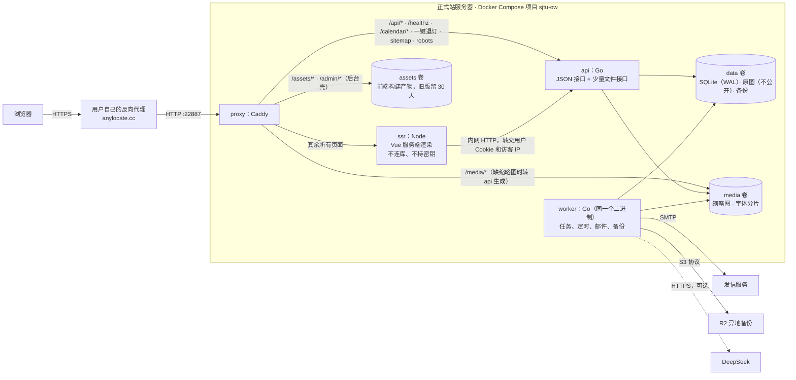

# 12 · 新站架构规划（Vue 3 + Go）

- **写于** 2026-10-07，基线 `ec44ae4`（217 轮）。作者 Claude，在 GLM 这套调研（00–11）之上做的。
- **状态：D1–D4 已拍板（2026-10-07，用户全按推荐，见 12.1 末尾「拍板结果」）；D5–D7 按推荐走，D8、D9 到检查点 B 和割接前再问。M0 的五个实验 220 轮做完，结论已落进本文（第 15 节修订记录）。** 原来写的「先改 `docs/design.md`」改成：**设计 v8.0 草案写在 `docs/design-next.md`**（221 轮，用户同意：割接前 `design.md` 继续描述现行站，割接时按草案第 8 节合并），不再直接改 `design.md`。
- **和 `00-plan.md` 的关系**：00 是 GLM 的计划总纲；这份是落到「怎么搭」的架构规格，和 00 不一致的地方以这份为准，差异汇总在第 14 节。
- **读法**：先看第 1 节（对调研的核对）和第 2 节（架构不变量），再看第 3 节的总图；第 5–10 节是给写代码的人的规格；第 11–13 节是计划、决定、风险。

---

## 1. 对 GLM 调研的核对

12 份文档全部读过，抽查了代码里的十几处事实（Markdown 库、Fernet 密钥派生、Alpine 用量、签名用法、会话与哈希设置、设计第 2/15 章原文等）。**总体可信**：路由、模型、237 条规则、基础设施、契约这几份的 file:line 抽查都对得上，数字口径的出入 README 自己也标了。可以当规格用。

下面是**核对出来的出入和遗漏**，其中前三条会直接影响架构：

| # | 问题 | 依据 | 影响 |
|---|---|---|---|
| 1 | **漏了：日历订阅地址和退订链接是用 Django 的 `SECRET_KEY` 签名的**。日历用 `signing.Signer(salt="sjtu-ow.calendar").sign_object()`，195 轮以前的老地址和退订链接用 `signing.dumps()`。换栈后要是验不了旧签名，**成员手机上订阅的日历会静悄悄断掉**，发出去的信里的退订链接全部失效 | `core/calendar_feed.py:18-46`、`core/services.py:124-136` | Go 要照 Django 的签名算法实现验证（第 5.11 节），旧 `DJANGO_SECRET_KEY` 作为签名密钥继续用 |
| 2 | **漏了：设计 2.1 明文写着「不依赖 Redis、PostgreSQL、Node 等额外服务」**。00 推荐的 Nuxt SSR 等于改这条设计原则，不是单纯的技术选型 | `docs/design.md:149` | 列为决定 D1（第 12 节） |
| 3 | **漏了：设计 13.7、13.17 承诺「没有脚本时照旧整张提交，登录、报名这类关键流程也一样能用」**。Vue 重写不处理的话这条承诺就破了 | `docs/design.md:2759`、`:3573` | 列为决定 D2 |
| 4 | 渲染方案只列了「Nuxt SSR」和「SSG + 插槽」，漏了「纯客户端渲染、不要 Node」这一种；而 SSG 方案生产里照样要 Node（内容变了要重新渲染），比 SSR 只多不少 | 00 第三节第 1 条 | 第 3.5 节重新比较 |
| 5 | Nuxt 的服务端状态传递靠内联脚本，严格 CSP 下要改成每请求 nonce（nuxt-security 的做法），`script-src` 就不再是现在测试钉死的 `'self'` | Nuxt 社区方案均为 nonce | 推荐自己写薄 SSR，不用 Nuxt（第 6.2 节） |
| 6 | 「cgo 要不要接受」不需要拍板：`modernc.org/sqlite`（BSD-3，纯 Go，DSN 支持 `_txlock=immediate`，2026-09 的 v1.60.1 带 SQLite 3.53.4）+ `github.com/gen2brain/webp`（MIT，不用 cgo，libwebp 经 wasm2go 转成纯 Go，支持有损质量参数）就能做到 `CGO_ENABLED=0` | pkg.go.dev 核过 | 镜像可以是一个静态二进制，交叉编译无障碍 |
| 7 | chi 不必要：Go 1.22 起标准库 `ServeMux` 支持「方法 + 路径参数」；Go 1.25 起标准库有 `http.CrossOriginProtection`（按 `Sec-Fetch-Site`/`Origin` 拒绝跨站写请求），CSRF 令牌那一整套可以不要 | 本机 Go 1.26.5 `go doc` 核过 | 少一个依赖；`csrftoken` Cookie、预渲染「不得含 CSRF 令牌」这类红线一起消失 |
| 8 | `golangci-lint` 是 **GPL-3.0**。只是开发工具、不进产物，但硬规则 5 写的是「GPL 不行」，按规则不用它 | 仓库 LICENSE 核过 | 用 `go vet` + `staticcheck`（MIT）+ `govulncheck`（BSD） |
| 9 | 数据导入放在 M10 太晚：真实数据是最好的测试数据，导入器应该每个领域里程碑各写一段，staging 一直跑在最新备份导入的数据上 | — | 第 8、11 节改了顺序 |
| 10 | 09-9（正式站 cron 按柏林夏令时写死，**10-25 起整体晚一小时**）是现行站的事，有时限，不能等重写 | 11 号文档自己标了 | 第 11.1 节「先做」 |
| 11 | 「约 7.3 万行业务 Python」口径偏大：非测试、非迁移的业务代码约 3.3 万行，测试约 3.7 万行 | `wc -l` | 不影响结论，工作量估计照旧 |
| 12 | Alpine「每页加载、0 个 `x-*` 指令」属实 | grep 核过 | 直接去掉 |

---

## 2. 架构不变量（先定下来、写进设计的规矩）

这些是新站在任何选型下都要成立的规矩。大部分来自现行站踩过的坑（11 号文档 ④B），每条都要有「拆掉就会红」的测试。

1. **业务真相只有一处：Go 的服务层。** 状态字段只能经服务函数改（照搬设计 17.3）。渲染进程（Node）只负责把 Go 给的数据画成 HTML：**不连数据库、不持有任何密钥、不做任何权限判断**。
2. **一个 SQLite 文件、一个写者。** 写事务用 `BEGIN IMMEDIATE`；**写事务里不联网、不解码图片、不做任何可能超过 100 毫秒的事**——写事务有看门狗，测试里超过 1 秒直接失败（对应 15-2：保存时联网查 b23 占着全库写锁）。
3. **任务和业务写在同一个事务里入队**（任务表就在同一个库里），比现在的 `on_commit` 更强：要么都成、要么都不成。
4. **公开页面不再预渲染、不缓存 HTML。** 每次请求现渲染。下线、转私密的内容在提交的那一刻就不可见（对应 04-2、08-2/15-4 整类问题）。
5. **每个接口都在注册表里声明**：方法、路径、谁能用、限流、请求/响应类型、查询预算。路由、前端调用代码、守门测试、乱填测试都从注册表生成（相当于把 `placed()` 和「每个后台地址都过门」推广到全站）。
6. **登录入口全站唯一**，所有登录路径共用同一套邮箱验证门和限流（对应 04-1）。
7. **所有上传走同一条管线**：先读图头查像素再解码、解码失败即拒、重新编码去掉 EXIF/GPS、原图不公开、每日次数和磁盘配额、替换时删旧文件（对应 07-1/07-2/07-3/02-1/02-2/02-4）。
8. **每个可编辑的对象带版本号**，「同一个人在另一个标签页」也算并发；每个写请求可带幂等键，回执丢了重试能拿到原回执（对应 11-2/12-2/05-1/06-2）。
9. **限流计数单独一张表**，不跟任何缓存共用淘汰策略；IPv6 按 /64 聚合（对应 13-1/13-2）。
10. **定时任务在 worker 里按 `Asia/Shanghai` 显式计算**，不靠宿主 cron、不按某地夏令时换算（对应 09-9）。
11. **CSP 不放松**：前台 `script-src 'self'`（去掉 speculation rules 后连 `'inline-speculation-rules'` 都不要了），零内联脚本、零内联样式属性；后台也按同一标准。
12. **URL、视觉、文案不变。** 现有地址（含 `/accounts/login/` 这类）一个不改；`c-*`/`l-*`/`b-*` 样式原样搬；设计 13.2 继续有效。
13. **依赖只收 MIT、BSD、Apache-2.0、ISC 这类宽松许可证**，开发工具也一样；新增依赖先问（硬规则 5 不变）。

---

## 3. 总体架构

### 3.1 拓扑



### 3.2 进程与容器

| 服务 | 内容 | 挂载 | 密钥 | 内存估计 |
|---|---|---|---|---|
| `proxy` | Caddy 2.10（照旧），只听 22887 的 HTTP，HTTPS 由用户的反代负责 | assets（只读）、media（只读） | 无 | ~30 MB |
| `api` | `sjtuow serve`：全部 JSON 接口、少量文件接口（日历、导出、CSV、邮件预览、缩略图兜底生成） | data、media | 全部（见 5.16） | ~50–150 MB（Argon2 一次 100 MB，有并发上限） |
| `worker` | `sjtuow worker`：任务队列三条车道、定时器、心跳、备份 | data、media、assets（清理旧文件） | 全部 | ~50–200 MB（图片和备份时） |
| `ssr` | `node server.js`：Vue 服务端渲染 | 无 | **无** | ~100–150 MB |

现在的 `web`（gunicorn 5 个进程）+ `worker` 大约 1 GB 上下，新的四个加起来预计更少。

### 3.3 一次请求怎么走

**访客打开战队页 `/teams/12/`**
1. Caddy：不是 `/api/`、`/assets/`、`/media/` → 转给 `ssr`，带上 `X-Real-IP`。
2. ssr：Vue Router 匹配到 `TeamDetail`，并行调 `GET /api/page/teams/12` 和 `GET /api/session`（内网，转交原请求的 Cookie、访客 IP、请求编号）。
3. api：注册表查到这个接口是公开的，跑服务层，一般 1–3 毫秒、查询数在声明的预算内。
4. ssr：`renderToString`（约 5–15 毫秒），把页面数据放进 `<script type="application/json" id="ow-state">`（数据块，不执行，CSP 不拦），返回 HTML。访客响应 `Cache-Control: no-cache`，登录用户 `private, no-store`。
5. 浏览器：`theme.js`（head 里的外部小脚本）在首帧前定深浅色；入口脚本读数据块、激活页面，不再请求一遍。

**登录用户打开同一页**：完全一样，只是 `/api/session` 返回了昵称、头像、待发信数，`/api/page/teams/12` 里的 `viewer` 部分返回「申请入队」表单或「你是队长」。**不再有插槽、骨架、`ow_logged_in` 提示 Cookie、`/_fragments/state/`。**

**页面里点链接**：激活之后是客户端导航——路由先调 `/api/page/...`（顶部加载条走起来），拿到数据再换页。数据和服务端渲染用的是同一个接口。

**提交入队申请**
1. 浏览器 `POST /api/teams/12/applications`（JSON，带幂等键）。Go 的 `CrossOriginProtection` 先拒掉跨站请求，再过注册表声明的门（登录 + `can_use(team_apply)`）和限流（20 次/天/人）。
2. 服务层在一个写事务里二次检查、写申请、把「给队长的信」冻结进待发信批次（设计 10.5）、把 AI 送审任务写进任务表。
3. 响应 `{"application": {...}, "letters": {"batch": "…", "count": 1}}`。前端的接口封装看到 `letters` 就跳到发信确认页（和现在「动作后跳确认页」一致），确认后回原页。

**后台改赛事（自动保存）**：`PATCH /api/admin/tournaments/7`，请求体 `{"base_version": 12, "changes": {"title": "…"}}`，规则见 5.5。

### 3.4 Caddy 路由

| 路径 | 去向 | 缓存 |
|---|---|---|
| `/assets/*`（带哈希） | assets 卷 | 1 年 immutable |
| `/static/img/*` 等少数固定地址（图标、分享图、旧邮件和外站引用过的） | assets 卷里的兼容拷贝 | 1 天 |
| `/media/r/*`（新缩略图） | media 卷；文件不在就转 `api` 生成（只认白名单规格） | 1 年 immutable |
| `/media/images/*`（旧缩略图，正文里写死了这些地址） | media 卷原样 | 1 年 immutable |
| `/media/fonts/*` | 只放行带哈希的样式表和分片，其余 404（照旧） | 1 年 |
| `/media/*` 其他 | 404（**原图不再公开**） | — |
| `/api/*`、`/healthz`、`/calendar/*`、`/sitemap.xml`、`/robots.txt` | api | 由 api 决定 |
| `POST /unsubscribe/*` | api（RFC 8058 一键退订，发信服务商直接 POST 这个地址，旧信里的地址也得接住） | no-store |
| `GET /admin/*` | assets 卷里后台 SPA 的 `index.html` | no-cache |
| 其余 `GET`/`HEAD` | ssr | 由 ssr 决定 |
| 其余写请求 | 405 | — |
| 502/503/504 | `maintenance.html`（照旧） | no-store |

**安全头统一由 Caddy 加**（CSP、HSTS、`X-Content-Type-Options`、`Referrer-Policy`、`frame-ancestors`），按路径三套：前台、后台、邮件预览。一处定义，e2e 测试对真实响应断言（对应 16-2「没有测试检查响应真的带严格 CSP」）。请求体上限：上传接口 10 MB，其余 1 MB（对应 14-2）。

### 3.5 为什么是「每次现渲染」，以及另外两个方案

| | **A. 薄 SSR（推荐）** | B. 纯客户端渲染 | C. 预渲染（00 的方案 B） |
|---|---|---|---|
| 生产里有没有 Node | 有（一个无状态容器） | **没有** | 有（重新渲染要用） |
| 首屏 | HTML 到了就能看 | 等 JS 下完、执行完才有内容 | HTML 到了就能看 |
| 百度收录 | 好 | 差（百度对脚本渲染的页面抓取不好） | 好 |
| 微信分享卡片 | 好 | 好（Go 往外壳里注入标题和分享图） | 好 |
| 无脚本能读 | 能 | 不能 | 能 |
| 登录态 | 直接渲染 | 直接渲染 | 插槽 + 提示 Cookie + 片段接口（现在这套） |
| 下线即消失 | 天然成立 | 天然成立 | 要失效逻辑，有竞态（08-2、04-2） |
| 额外的坑 | 激活不一致（hydration mismatch） | 无 | 失效、竞态、一致性 |
| 改设计 2.1 | 要改（加 Node） | 不用 | 要改 |

性能账：设计 15.1 假设同时在线 200 人以内。Go 页面接口 1–3 毫秒，Vue 渲染 5–15 毫秒，峰值每秒十来个页面，一个核用不到 20%；设计要求的「服务端 95% 在 300 毫秒内」宽裕。服务器在海外，**延迟主要在网络上**，所以首屏能不能「HTML 到了就能看」比服务端快几毫秒重要得多——这是推荐 A 而不是 B 的主要理由；第二个理由是百度收录。A 的代价是生产多一个 Node 容器、要守 SSR 的写法纪律（6.3）。

C 没有理由选：它保留了现在最复杂、出事最多的那一块，还要 Node。

---

## 4. 技术选型

| 部分 | 选型 | 许可证 | 理由 / 替代 |
|---|---|---|---|
| 后端语言 | Go（测试机锁 1.26.8，223 起随安全更新走 1.26.x；本机是 brew 的更新版） | BSD | 用户指定 |
| HTTP 路由 | 标准库 `net/http.ServeMux` | BSD | 1.22 起有方法和路径参数，够用；不要 chi |
| CSRF | 标准库 `http.CrossOriginProtection` + 会话 Cookie `SameSite=Lax` + 写接口只收 JSON/multipart | BSD | 不再有 CSRF 令牌 |
| SQLite 驱动 | `modernc.org/sqlite` | BSD-3 | 纯 Go，`_txlock=immediate`、`_pragma`、在线备份 API 都有；备选 `ncruces/go-sqlite3`（MIT） |
| 查询 | `sqlc` 生成静态查询 + 手写少量动态筛选 SQL | MIT | 显式 SQL，杜绝懒加载 N+1；后台列表的组合筛选 sqlc 写不好，手写 |
| 迁移 | `pressly/goose`（SQL 文件，嵌进二进制） | MIT | sqlc 认它的注释格式 |
| 密码 | `golang.org/x/crypto/argon2` + 标准库 PBKDF2 | BSD | 认 Django 的两种哈希格式 |
| 字段加密 | `github.com/fernet/fernet-go` | MIT | 密钥派生和现在一样，密文原样搬 |
| Markdown | `github.com/yuin/goldmark` + 自写扩展 | MIT | 渲染规则逐条移植（5.12） |
| 图片 | 标准库 `image/*` + `golang.org/x/image`（缩放、WebP 解码）+ `github.com/gen2brain/webp`（WebP 编码） | BSD / BSD / MIT | 全部纯 Go；EXIF 方向自己读（只要一个标签，几十行） |
| 邮件 | `github.com/wneessen/go-mail` | MIT | 标准库 `net/smtp` 已冻结 |
| 对象存储 | `github.com/minio/minio-go/v7` | Apache-2.0 | 比 aws-sdk 小 |
| 日志 | 标准库 `log/slog` | BSD | 不记 IP（设计 15.5） |
| Go 检查 | `go vet`、`staticcheck`、`govulncheck` | BSD/MIT/BSD | **不用 golangci-lint（GPL-3.0）** |
| 前端 | Vue 3 + TypeScript + Vite + vue-router | MIT | 用户指定 |
| SSR | 自己写的薄服务（Vite SSR 构建 + `@vue/server-renderer`） | MIT | 不用 Nuxt：CSP 要 nonce、框架约定多；回退方案是 Nuxt + nuxt-security |
| 页头管理 | `@unhead/vue` | MIT | 标题、描述、分享卡片 |
| 样式 | Tailwind CSS 4（`@tailwindcss/vite`）+ 现有 `input.css` 原样 | MIT | 视觉零变化 |
| 拖拽 | SortableJS（照旧） | MIT | |
| Markdown 编辑器 | CodeMirror 6 + 自己的工具栏 | MIT | 换掉 EasyMDE（带的 CodeMirror 5 有 CVE-2025-6493，12-4） |
| 前端测试 | Vitest、`@vue/test-utils`、`vue-tsc` | MIT | |
| 浏览器测试 | Playwright | Apache-2.0 | `journey.py` 三种模式移植 |
| Go 变异测试 | 自写守卫变异器（照 `mutate_guards.py`）+ 可选 `gremlins` | — / Apache-2.0 | |
| 包管理 | pnpm（本机已装） | MIT | |
| Node | Node 24 LTS（本机 24.13） | MIT | |

**不要的**：Redis、PostgreSQL、消息队列、GraphQL、ORM、Pinia（先用组合式函数，真需要再议）、任何 CSS 组件库、任何 CDN。

---

## 5. 后端（Go）

### 5.1 目录

```
server/
├── go.mod
├── cmd/sjtuow/              一个二进制，子命令：serve、worker、migrate、import、reconcile、
│                            backup、restore、createsuperuser、verify-email、apigen、rulecheck
├── db/
│   ├── migrations/          goose 的 SQL 文件（嵌进二进制）
│   └── queries/             sqlc 的查询，每个领域一个文件
├── internal/
│   ├── platform/            和业务无关的底座
│   │   ├── config/          环境变量，缺了就拒绝启动
│   │   ├── db/              连接池、WriteTx、看门狗、查询计数（测试用）
│   │   ├── api/             接口注册表、请求解析、错误格式、幂等键、生成 TS 的元数据
│   │   ├── auth/            密码哈希（Django 兼容）、会话、验证码、重新认证
│   │   ├── ratelimit/
│   │   ├── jobs/            任务表、三条车道、定时器、心跳
│   │   ├── mail/            SMTP 发送、重试
│   │   ├── letters/         信纸（34 种信的结构、HTML/纯文本双版本、内嵌图）
│   │   ├── outbox/          待发信批次（设计 10.5）
│   │   ├── djsign/          Django 签名算法（日历、退订的旧地址）
│   │   ├── crypto/          Fernet
│   │   ├── images/          上传管线、缩略图规格、配额
│   │   ├── markdown/        唯一的渲染器
│   │   ├── storage/         S3
│   │   ├── audit/           操作记录
│   │   └── clock/           可注入的时钟（测试冻结时间）
│   ├── accounts/  content/  media/  comments/  teams/  members/
│   ├── tournaments/  scrims/  notify/  moderation/  search/
│   ├── sitecfg/             全站设置、排版、字体
│   ├── backoffice/          后台导航、待办、活动数据、操作记录查看
│   ├── ops/                 备份、恢复、清理、健康检查
│   ├── legacy/              读旧库的工具（导入器共用）
│   └── store/               sqlc 生成的代码
└── testdata/
```

每个领域包里固定几样文件：`service.go`（业务规则，**状态只在这里改**）、`api.go`（前台接口，薄）、`api_admin.go`（后台接口）、`letters.go`（这个领域发的信）、`jobs.go`（这个领域的任务）、`import.go`（从旧库导入这个领域的表）、`*_test.go`。

### 5.2 分层

```
HTTP（api.go：解析参数、调服务、包结果）
  └→ 服务（service.go：权限二次判断、业务规则、写事务、入队、冻结待发信）
       └→ store（sqlc 生成的查询）+ platform 底座
```

- 处理函数不写 SQL、不判断业务条件；服务函数不碰 `http.Request`。
- 服务函数第一个参数是 `*app.Ctx`（携带当前用户、时钟、待发信批次、请求编号），后台、前台、worker、导入器调同一个函数。
- 注册表上声明的门是第一道；服务函数里对「这条记录是不是你的」「这个状态能不能做」再判一次（例如队长身份、评论所属文章是否公开——对应 03-1）。

### 5.3 接口注册表

```go
// internal/teams/api.go
func (m *Module) Routes(r *api.Registry) {
    api.Get(r, "/api/page/teams/{id}", api.Public, m.teamPage,
        api.Budget(12))                                   // 查询数上限，测试按 3 份和 10 份数据各跑一遍
    api.Post(r, "/api/teams/{id}/applications", api.Feature(accounts.TeamApply), m.apply,
        api.Limit(ratelimit.PerUser, 20, 24*time.Hour))   // 设计 15.2 的数字
    api.Patch(r, "/api/admin/teams/{id}", api.Cap(caps.TeamsAdmin), m.adminPatch,
        api.Nav("members", "teams"))                     // 后台位置：大类、标签
}
```

- `api.Get/Post/Patch/Delete` 是泛型函数，`m.apply` 的签名是 `func(*app.Ctx, ApplyIn) (ApplyOut, error)`，请求和响应的类型就是生成 TS 的依据。
- 门的种类：`Public`、`Member`（登录且启用）、`Verified`、`Feature(f)`（`can_use`）、`Cap(c...)`（后台能力）、`Superuser`、`Token`（签名地址：日历、退订）。**没声明门的接口注册时直接 panic**。
- 路径参数 `{id}` 统一按 `[0-9]{1,18}` 解析，不合格就 404（照搬 `<id:pk>` 和 `as_id()`）。
- JSON 解析严格：未知字段报 400，单个请求体 1 MB 上限。
- 由注册表生成：① 路由；② `web/packages/api/src/gen/`（类型和调用函数）；③ 后台导航 `nav.ts`；④ 守门矩阵测试；⑤ 乱填测试；⑥ 限流数字和设计附录 C 的对照测试；⑦ 查询预算测试。CI 重新生成一遍，`git diff --exit-code`（和 `makemigrations --check` 一个意思）。

### 5.4 接口约定

**命名空间**

| 前缀 | 用途 | 说明 |
|---|---|---|
| `/api/session` | 当前访客是谁 | 昵称、头像、能力列表、资料是否不全、待发信数、一次性提示 |
| `/api/page/...` | 页面数据（只读） | **一页一个接口**，按页面的需要整形，含 `viewer` 部分；避免一页几个请求 |
| `/api/auth/...` | 认证动作 | 登录、注册、验证码、重置、改密码、改邮箱、重新认证、退出 |
| `/api/...` | 前台动作 | 业务动作用「资源 + 动词」：`POST /api/team-applications/{id}/approve` |
| `/api/admin/...` | 后台 | 页面数据和动作都在这下面 |

**错误**：统一一种形状，字段错误和自动保存共用。

```json
{ "error": { "code": "invalid", "message": "有几处要改" },
  "fields": { "name": ["队名已被使用"], "__all__": ["报名已截止"] } }
```

| 状态码 | 什么时候 |
|---|---|
| 400 | 请求本身坏了（类型不对、JSON 坏） |
| 401 | 没登录（前端跳 `/accounts/login/?next=`） |
| 403 | 没权限。**文案固定，不说原因**（规则 12）；草稿、未发布的东西对没权限的人一律 404（规则 148） |
| 404 | 不存在 |
| 409 | 版本冲突（带 `current`：服务器上的最新值和版本号） |
| 422 | 业务校验不过（带 `fields`） |
| 429 | 限流（带 `Retry-After`） |

**GET 不写**：页面接口不改业务数据、不设 Cookie（唯一例外：限流计数、会话的「最后访问时间」每小时最多写一次）。

### 5.5 自动保存协议 v2

现在的协议（08 号文档 1.2）是「表单整张 POST + `X-Autosave: 1`」。新协议改成按字段打补丁，语义保持：

```
PATCH /api/admin/tournaments/7
Idempotency-Key: <每次保存尝试一个，重试沿用>
{ "base_version": 12, "changes": { "title": "春季赛", "roster_min": 0 } }

200 { "version": 13, "saved": ["title"], "fields": { "roster_min": ["至少 1 人"] },
      "values": { "slug": "chun-ji-sai" }, "saved_at": "2026-10-07T14:32:00+08:00" }
409 { "error": {"code": "stale", "message": "另一个人刚改过，已换成最新内容"}, "current": {...} }
```

- **字段各自校验**：合法的存、不合法的留旧值并报错（规则 47）；跨字段规则用「一起存」组声明（现在的 `autosave_together`），组里任一字段出错整组不存；表单级错误且没声明组就整次不存。
- **版本号对所有人生效**，包括同一个人在另一个标签页（11-2 的根）。文章的「版本号」就是最新修订号。
- **幂等键所有写请求都认**（不只是新建）：同一个人同一个键 24 小时内重放，直接返回当时的回执（含新版本号）。这样「存好了但回答丢了」重试时拿到的是新版本号，不会把自己当成「别人改过」（12-2）。现在的 `AutosaveReplayMiddleware` 是它的特例。
- **新建**：`POST /api/admin/articles`（带幂等键）用第一次改动的合法字段建草稿，返回 `{id, location, version}`，前端 `history.replaceState` 换地址（规则 46）。
- 合并操作记录：同一个人 30 分钟内对同一对象的编辑合并成一条（照旧）。
- 前端状态机见 6.7。

### 5.6 数据库访问

- **两个连接池**：写池 `MaxOpenConns(1)`，DSN `_txlock=immediate`、`_pragma=busy_timeout(5000)`、`journal_mode(WAL)`、`synchronous(NORMAL)`、`foreign_keys(ON)`；读池若干连接、只读。进程内的写由写池串行。
- **进程之间：先 `flock`，再 `BEGIN IMMEDIATE`**（220 轮 E3 实验）。`api` 和 `worker` 两个进程写同一个文件时，光靠 IMMEDIATE + busy_timeout 能保证不丢更新、不坏库，但 SQLite 的忙等是轮询不是排队：一个一直在写的进程能让另一个等过 `busy_timeout`，在测试机上 1 万步里出现过 1 次、8 个进程时 800 步里 8 次 `SQLITE_BUSY`。`WriteTx` 因此是「对 `<库>.wlock` 拿 `flock(LOCK_EX)` → `BEGIN IMMEDIATE` → 提交或回滚 → 放锁」，`busy_timeout` 留作兜底；同样的负载下零 busy。写进程只有 `api` 和 `worker` 两个；单写者吞吐上限约 700 事务/秒（4 核测试机），比峰值需求（每秒十来个写）高两个数量级。**两个容器共享数据卷时 `flock` 是否同样有效，M1 要在 Compose 里两个容器各压一轮来证实**（E3 用的是两个进程）。对照组：不用 IMMEDIATE（普通 `BEGIN`），同样负载下 3100/4000 步立刻 `SQLITE_BUSY`。
- **`db.WriteTx(ctx, func(tx) error)`** 是唯一的写入口：看门狗记事务时长，开发和测试里超过 1 秒失败、生产里超过 200 毫秒记警告；事务里要入队就 `jobs.Enqueue(tx, ...)`，要发信就 `outbox.Send(tx, ...)`。
- 「检查—写入」一律在同一个写事务里做（建队上限、审批时满员、编队、报名名额——规则 85、92、130）。事务外读到的数据只拿来展示。
- **时间**：库里一律 UTC 文本 `YYYY-MM-DDTHH:MM:SS.ffffffZ`（可排序、命令行里看得懂）；显示和定时一律显式 `Asia/Shanghai`（二进制里嵌 `time/tzdata`，不依赖镜像里的时区文件）。
- **大小写不敏感的唯一**（邮箱、battletag、活跃队名、分组名）：存一列规范化后的值（Go 里 `strings.ToLower` + Unicode 规范化）建唯一索引，比现在只折叠 ASCII 的 `Lower()` 更严（顺带修 10-6）。
- 表用 SQLite 的 `STRICT` 模式；Django 模型里的 Check 约束、条件唯一约束全部照搬成 SQL。
- 测试里给 `database/sql` 包一层计数，供查询预算测试用。

### 5.7 认证与会话

**密码**
- 认三种存量格式：`argon2$argon2id$v=19$m=102400,t=2,p=8$<盐>$<哈希>`（Django 的 Argon2）、`pbkdf2_sha256$<轮数>$<盐>$<哈希>`（兜底）、`!` 开头（不可用，注销账号）。
- **新写的哈希仍用 Django 的 Argon2 格式和参数**：割接后两周内要回滚的话，旧站照样认新密码。PBKDF2 的在下次登录时升级成 Argon2。
- Argon2 一次占 100 MB 内存，加一个并发信号量（同时最多 2 个），超了排队，避免几十个人同时登录把容器撑爆。
- 校验规则照旧（最少 8 位、不能是常见密码、不能纯数字、不能太像邮箱和昵称）。常见密码表用 Django 自带那份（BSD），嵌进二进制。

**会话**
- `sessions` 表：随机 32 字节令牌，库里只存 SHA-256；Cookie `ow_session`，`HttpOnly; Secure; SameSite=Lax`，登录起 14 天。
- 改密码时删掉这个人的其他会话；停用、注销时删全部会话。
- 重新认证：会话上记 `reauth_at`，改邮箱要求 5 分钟内输过密码（设计 v7.19）。
- **割接时全员重新登录**（不搬 Django 会话），提前公告。

**流程**（逐条照 allauth 的现行配置，数字见规则 2–8）

| 流程 | 要点 |
|---|---|
| 注册 | 邮箱、两次密码、昵称、是否交大、两个协议分开勾；建「未验证」账号；发 6 位验证码（15 分钟、试 3 次、重发每 10 秒 1 次）；已注册的邮箱发「已注册过」的信、页面表现一样（防枚举）；**不发会话**（241 起改：两个分支响应必须同形，`Set-Cookie` 头会泄露邮箱是否注册过，已注册分支又绝不能发真会话） |
| 验证 | 凭「邮箱 + 6 位码」核验（不需要会话）；码不对、过期、用尽、邮箱没注册，一律同一句报错（防枚举）；核验通过即登录（发会话），落到个人资料页并提示补全。「半登录」会话没有了：未验证用户就是访客，Verified/Feature/Cap 门自然拒绝（241 起改） |
| 登录 | 只认邮箱；错误统一「邮箱或密码不正确」；停用账号拒绝；未验证的（密码正确时）发新码并提示去验证页，不发会话；限流 30/分/IP + 失败 5 次/300 秒/账号（R006） |
| 重发验证码 | POST /api/auth/resend-code；邮箱必填且有效（非法 422）；防枚举响应（未注册/停用/已验证/未验证均返回同形成功响应）；未验证账号作废旧码并生成 6 位新码发信（15 分钟有效、试 3 次，R002）；已验证账号发提示信；限流 10/分/IP（AuthResendEmailCode）+ 1/10秒/账号（AuthResendEmailCodeKey，R006）；不发会话 |
| 找回密码 | POST /api/auth/reset-password 发 6 位码（3 分钟有效、试 3 次，R003）；未注册邮箱发「没有注册」提醒信、页面表现一样防枚举（R004）；限流 20/分/IP（AuthResetPassword）+ 5/分/账号（AuthResetPasswordKey，R006）；POST /api/auth/reset-password/confirm 核验 6 位码并重置密码（密码强度校验、Argon2 哈希、删全部现有会话、限流 20/分/IP AuthResetPasswordConfirm）；不发会话 |
| 改邮箱 | 5 分钟内重新认证过；新邮箱收码验证后才替换；撞上别人占着的地址给出明确错误（顺带修 10-2） |
| 退出 | `POST /api/auth/logout` |

**验证码**存 `email_codes` 表（用途、邮箱、码的哈希、尝试次数、过期时间），不放缓存。

**唯一入口**：只有 `/api/auth/login` 和 `/api/auth/verify-email` 这两个接口能建会话（后者核验通过即登录，241 起），别的任何地方都没有；`createsuperuser`、`verify-email` 命令只改数据、不建会话。有测试遍历注册表断言这一点。

### 5.8 权限模型

现在是 Django 组 + Django 权限位 + Wagtail 页面权限 + Wagtail 图片集合权限四套叠在一起。新的收成一套：

- **角色**（存库）：内容编辑、赛事管理员、内战管理员、认证作者；超级管理员是用户上的一个标志。
- **派生角色**（不存库，现算）：交大用户 / 校外用户（看 `is_sjtu`）、投稿者（启用 + 邮箱已验证）。**不再有「每次保存同步进组」的信号**，10-1 那种「关掉投稿权限就无限递归」从结构上消失；04-4「改 is_sjtu 后组被改回」也一样。
- **能力**（代码里的枚举）：`admin.enter`、`content.publish_own`、`content.edit_any`、`content.edit_author`、`content.categories`、`content.site_pages`、`images.contribute`、`images.manage`、`tournaments.manage`、`scrims.manage`、`contacts.view`、`comments.moderate`、`moderation.review`、`members.groups`、`activity.view`……；**角色 → 能力**的对照表写在代码里（`internal/accounts/roles.go`），照设计第 4 章的权限矩阵逐格搬，测试拿它和设计里的矩阵逐格对。超管拥有全部能力。
- **`can_use(user, feature)`** 判定顺序照旧（规则 11）：未登录/停用 → 拒；单人规则优先；所在角色（含派生角色）任一有限制 → 拒；默认允许。能投稿 = 投稿者 ∧ `can_use(article_submit)`；能进后台 = 有任一管理角色 ∨ 能投稿。
- 「角色和功能限制」后台页照旧可以改：谁有哪个角色、哪个角色禁用哪项功能、单人规则。**不再提供细到权限位的编辑**（那是 `/wagtail/groups/` 的事，新站没有 `/wagtail/`）。

### 5.9 限流

- `rate_counters(key, bucket, count)` 表，整分钟（或整小时、整天）一个桶，`INSERT … ON CONFLICT DO UPDATE SET count = count + 1 RETURNING count` 原子计数；worker 每天删过期的桶。时间片按窗口取（UTC，固定窗口）：<1 分钟按秒片（如 10 秒片），≤1 分钟按整分钟，不满 24 小时按整小时，≥24 小时按整天。不能把「≤1 小时」划进分钟片，否则表里「每小时 5 次」会变成每分钟 5 次（224 轮）；秒片用 `Truncate(window)` 保证例如 10 秒窗口（242 轮）不会被扩大为 1 分钟。
- 访客 IP 只认可信代理（Caddy、ssr 所在的 Docker 网段）传来的 `X-Real-IP`；IPv6 取 /64。
- 所有数字集中在 `internal/platform/ratelimit/limits.go` 一张表，和设计附录 C、规则 6、214–223 对照，测试钉住（包括现在没钉住的 allauth 那组，16 号低条目）。
- 默认规矩：**每个写接口都要声明限流**，没声明的注册时报错；确实不需要的写 `api.NoLimit("理由")`。

### 5.10 任务队列与 worker

```sql
CREATE TABLE jobs (
  id INTEGER PRIMARY KEY, kind TEXT NOT NULL, args TEXT NOT NULL,   -- JSON
  lane TEXT NOT NULL,                 -- mail | default | slow
  priority INTEGER NOT NULL DEFAULT 0,
  run_after TEXT NOT NULL, status TEXT NOT NULL,                    -- ready | running | done | failed
  attempts INTEGER NOT NULL DEFAULT 0, last_error TEXT NOT NULL DEFAULT '',
  dedupe_key TEXT,                    -- enqueue_once 用
  created_at TEXT NOT NULL, started_at TEXT, finished_at TEXT
) STRICT;
```

- **三条车道各一个 goroutine**：`mail`（验证码、所有信，优先级最高）、`default`（提醒、定时发布后的通知、外链解析、缩略图预热）、`slow`（AI 巡查、备份、清理、重新渲染）。慢活不再挡住验证码信（08-11）。
- 每 1 秒查一次到期任务（有索引，一条查询）。验证码「30 秒内进入 SMTP」宽裕。
- 启动时把 `running` 复位成 `ready`（照旧，接受广播可能重发）；**设计前提仍是只有一个 worker**，启动时在库里占一个锁行，第二个 worker 起不来。
- `enqueue_once`：同 `dedupe_key` 已有更早或同时到期的就不再排（规则 228）；提醒类任务执行时重读数据，时间后移就顺延自己（规则 138、147）。
- 邮件失败按 1/5/30 分钟重试 3 次后放弃、进超管待办（照旧）。
- 心跳写 `worker_status` 单行表（不放缓存，13-1）。

**定时器**（全部 `Asia/Shanghai`，不再要宿主 cron）

| 周期 | 做什么 |
|---|---|
| 每 30 秒 | 心跳；定时上线/到期撤下（规则 54）；AI 巡查是否到点（每 30 分钟最多一轮） |
| 每天 03:00 | 备份（5.15） |
| 每天 04:00 | 清理：完成的任务 30 天、已处理的审核记录 180 天、待发信 30 天、过期会话和验证码、过期限流桶和幂等回执、14 天没人处理的入队申请（关闭并通知）、7 天提醒队长、7 天无字的空草稿（**按标题、简介、正文都空判断**，修 09-2） |
| 每周日 04:30 | `PRAGMA optimize` + `wal_checkpoint(TRUNCATE)` |
| 每天 04:40 | 删 assets 卷里 30 天前的旧前端文件 |

每个定时项的上次运行时间记在 `schedule_runs` 表；worker 重启后发现错过了就补跑一次（宿主 cron 做不到）。04:15 的全量预渲染和 04:20 的旧静态清理都没了。

### 5.11 邮件、待发信、退订

- **信的结构**照 `core/letters.py`：`Letter{Greeting, Notice, Lead, Facts, Code, Items, Paragraphs, Action, Note, Reason, Unsubscribe}`，`html/template` 和 `text/template` 各一套，**信纸 HTML 逐字照搬 `templates/email/layout.html`**；头图两张 PNG 用 `go:embed` 嵌进二进制，`cid:` 引用（照旧）。
- 34 种信每种一个构造函数，放在各领域的 `letters.go`；样张页数据也在那里，后台「邮件样张」页用 iframe 显示 Go 渲染的 HTML（邮件预览那套 CSP）。验收：同样的假数据，新旧两边渲染的 HTML 规范化后一致。
- 发送：SMTP 配置在全站设置里（密码 Fernet 加密），20 秒超时，主题前缀统一加一次（照旧）。`EMAIL_ALLOWLIST` 测试环境白名单照旧。
- **待发信（设计 10.5）**：登录用户的每个写请求，框架在 `app.Ctx` 里放一个批次；服务层 `outbox.Send(tx, letter, recipients)` 有批次就冻结进 `held_letters`（同批次同内容合并收件人），没有（worker、命令）就直接入队。响应带 `letters: {batch, count}`，前端跳确认页；确认用条件更新一次性认领（防双击）。7 天过期、30 天清理、操作人注销时批次由系统代发（照旧）。
- **退订**：只有群发的活动通知带退订链接和 `List-Unsubscribe` / `List-Unsubscribe-Post`（RFC 8058）头。
- **Django 签名兼容**（第 1 节第 1 条）：`internal/platform/djsign` 实现 Django 的 `Signer.sign_object` / `unsign_object` 和 `signing.dumps` / `loads`（HMAC-SHA256，密钥 = SHA-256(盐 + "signer" + 密钥)，URL 安全 base64，带压缩标记的也认）。用 Python 生成一批真值写进 `testdata/` 当黄金用例。**新签发的地址也用同一算法、同一密钥**，这样只有一种格式。环境变量叫 `SIGNING_KEY`，值就是现在的 `DJANGO_SECRET_KEY`。

### 5.12 内容：页面、修订、定时发布、Markdown

**表**

| 表 | 内容 |
|---|---|
| `pages` | 四类页面的公共部分：`id`（**沿用 Wagtail 的页面编号**，评论、置顶、审核记录都不用改引用）、`kind`、`slug`、`title`、`live`、`has_unpublished_changes`、`go_live_at`、`expire_at`、首次/最近发布时间、`live_revision_id`、`latest_revision_id`、`owner_id`、`seo_title`、`search_description` |
| `articles` | `page_id`、分类、封面、简介、`body_md`、`body_html`、`body_plain`、字数、阅读分钟、作者、是否开评论、关联赛事、`search_text`、`renderer_version` |
| `site_pages` | 普通页（协议、隐私、关于）：`body_md`、`body_html`、`body_plain` |
| `news_index` / `home_pins` | 资讯栏目简介；首页置顶（≤3 篇） |
| `page_revisions` | `id`、`page_id`、`author_id`、`created_at`、`approved_go_live_at`、`content`（JSON） |

语义照 Wagtail：页面行上是**已发布的值**，草稿只在修订里；发布 = 把修订内容写回页面行并渲染。自动保存的「复用同一份修订」规则照旧（规则 43–45），只是冲突判断改成 5.5 的版本号。定时上线/撤下由 worker 每 30 秒检查（规则 54–57）。

**网址**：文章 `/news/<slug>/`，普通页 `/<slug>/`，保留字表照旧（规则 59），slug 生成和冲突加 `-2` 照旧（规则 58）。Wagtail 重定向表里要是有数据，搬进 `redirects` 表，由 ssr 在 404 前查一次。

**Markdown**（规则 61–72）：`internal/platform/markdown` 是唯一的渲染器，文章、普通页、赛事和内战说明、编辑器预览都用它。goldmark 开 GFM 表格、删除线、自动链接、单换行即换行，再加自写的几个变换：

- 原始 HTML 当文本原样显示（goldmark 默认是「省略」不是「转义」，要自己写渲染器）
- `#`/`##` → h2，`###` 及以下 → h3；目录在 h2+h3 ≥ 3 时出，锚点 `h-1`、`h-2`
- 单独成行的本站图片 → `<figure>` + 图注；行内本站图片 → 小图；外站图片 → 链接
- 单独成行的 B 站链接 → 播放器 iframe；b23 短链**只查本地缓存表 `embeds`**，没见过的记下来交给 worker 去解析（带超时、防内网地址，失败缓存 1 小时），解析完重新渲染引用它的页面。**渲染永远不联网**（15-2、01-2）
- 引用块最后一行以「——」开头 → 出处脚注
- 删除线要**两个**波浪线（goldmark 的 GFM 扩展一个也算，自己写行内解析器）；图注（`alt`）里的行内代码不进图注（和 markdown-it 一致）；`~~~三个~~~` 是 markdown-it 的怪癖（写成 `~<s>三个</s>~`），**声明为有意的差异**
- 字数、阅读分钟（规则 70）在保存时算好落库

**对拍**（220 轮 E4 已做第一遍：346 份文档、345 份和 markdown-it 一致、约 420 行 Go、1139 KB 的 Markdown 共 24 毫秒；语料是仓库自己的文档和 80 份刁钻输入，程序和语料生成脚本在 `handoff/rounds/220-m0-experiments/e4-goldmark/`，M4 把它搬进 `server/` 作黄金用例）：把正式站备份里所有文章、页面、赛事、内战的正文，用旧的 `content/markdown.py` 和新的 Go 渲染器各渲染一遍，规范化后逐篇比较，**每一处差异要么修掉、要么写明是有意的**（比如 01-3 的 `&` 转义两次、01-4 的链接末尾 `)`）。旧测试里的 Markdown 用例转成 Go 的黄金用例。

`body_html` 发布时生成；渲染规则改了就把 `renderer_version` 加一，worker 在慢车道把旧版本的重新渲染一遍。

### 5.13 图片

- **上传管线**（头像、队标、投稿图、后台上传全部走它）：
  1. 请求体上限 10 MB（Caddy + Go 双层），流式写进 data 卷的临时文件；
  2. 只看文件头（`image.DecodeConfig`）判格式（JPG/PNG/WebP）和尺寸，像素超上限（4000 万）、最短边不够直接拒，**不解码**；
  3. 解码在信号量里做（同时 1 个），解码失败即拒（07-1、02-12、02-8）；
  4. 按 EXIF 方向转正，按用途裁剪（头像中心裁方），长边压到 **2560** 像素以内（220 轮 E2：站上最大的缩略图 2400 宽，4000 宽的母版白占 3 倍时间和内存），重新编码成 WebP（质量 90，**方法 2**）存为母版 `data/originals/<id>.webp`——**上传的原文件丢弃**，GPS、设备信息随之消失（02-1/07-3）；**母版不公开**；
  5. 每日次数（头像 5 次，队标、投稿图各自的数字待设计定）和每人每日字节数配额；磁盘剩余低于 25% 时拒收所有上传。
- **纯 Go 的 WebP 比 libwebp 慢 3–5 倍**（220 轮 E2，同一张 4000×3000 的照片：2560 宽方法 2 的母版 0.38 秒（本机）/ 0.60 秒（测试机），libwebp 0.14 / 0.17 秒；4000 宽方法 4 要 3.3 / 4.9 秒，所以母版取 2560 和方法 2；一张 1200 万像素的图峰值内存约 710 MB，所以解码编码放在信号量里，同时只做一张）。编码放在一个接口后面：**将来生产里首次缩略图的 p95 超过 1 秒，就换成 cgo 的 libwebp（BSD），不改别的代码**。上传请求里只做「解码 + 母版」（测试机约 1 秒），缩略图一律首次被请求时在信号量里生成、原子写盘、缓存一年。
- **缩略图**：地址固定 `/media/r/<图片编号>/<规格>.webp`，规格只认白名单（`fill-88x88`、`fill-176x176`、`fill-288x288`、`fill-400x400`、`fill-960x540`、`fill-1280x720`、`fill-2400x1200`、`fill-2400x640`、`fill-2400x1350`、`max-1600x1600`，分享图 `fill-1200x630` 出 JPEG）。Caddy 先找文件，没有就转给 api 在信号量里生成、原子写盘、返回。母版不变，所以缩略图可以 1 年 immutable。
- **集合**用固定的 `key` 识别（默认封面、默认头像、用户头像、投稿），名字可改不影响功能（02-10）。
- **默认封面**「同一个对象永远同一张」的公式和排序照搬（`core/covers.py`），否则割接后全站封面会换一遍。
- **删除**：先查所有引用（头像、队标、封面、横幅、全站设置、正文里的地址），有引用就拒绝并列出在哪；删除时连缩略图目录一起删。
- 旧的 `/media/images/*` 缩略图文件原样留着（正文里写死了这些地址），旧的 `/media/original_images/*` 搬进 data 卷、不再公开。

### 5.14 搜索

照旧是子串匹配（规则 233）：每类内容一列 `search_text`（保存时写入：标题 + 简介 + 纯文本正文，统一大小写折叠），查询词折叠后按空格切成最多 5 个、每个都要 `instr(search_text, 词) > 0`，每类最多 20 条，每个 IP 每分钟 30 次。Wagtail 的 FTS 表不要了。

### 5.15 备份、恢复、健康检查、日志

**备份**（worker 每天 03:00，后台可手动触发）
1. `VACUUM INTO` 到临时文件（一致的快照，不撕裂 WAL）；
2. 打包 `db + data/originals + media` 成 `.tar.gz`，**先写临时名、`fsync`、再改名**（09-1）；
3. 设了 `BACKUP_ENCRYPTION_KEY` 就 Fernet 加密（密钥派生照旧）后传 R2，按前缀清旧的；
4. 结果写 `backup_runs` 表（开始、结束、大小、本地/异地状态、错误），后台待办看这张表：36 小时没成功、或最近一次失败，超管首页就提醒；
5. 本地留 14 天。

**恢复**：`sjtuow restore --from-s3 <key>`，在 data 卷里的私有临时目录（0700）流式解密、解包，**不落 `/tmp`**（09-5）；先试着用 `FIELD_ENCRYPTION_KEY` 解开全站设置里的密文，解不开就停；默认只演练，`--yes` 才替换。验收项：**在一台全新的机器上只靠一条命令从 R2 恢复出能用的站**（09-6）。

**`/healthz`**：数据库写探测（事务里写一行再回滚）、data 卷剩余 > 20%、worker 心跳 120 秒内、积压（`ready` 且 `run_after` 早于 10 分钟前的任务数，按到期时间算，修 09-4）。对外只给总状态和各项真假，详情只给超管（照旧）。ssr 另有自己的存活检查给 Compose 用。

**日志**：`slog` 输出 JSON 到标准输出；不记 IP、密码、验证码、联系方式、Cookie、请求体（设计 15.5）；请求编号由服务器生成（ssr 生成后经内网传给 api，api 只信可信代理传来的）；500 一定落完整堆栈和请求编号。

### 5.16 配置与密钥

| 环境变量 | 说明 |
|---|---|
| `SITE_URL` | 必填 |
| `SIGNING_KEY` | 必填，= 现在的 `DJANGO_SECRET_KEY`（5.11） |
| `FIELD_ENCRYPTION_KEY` | 必填，沿用 |
| `BACKUP_ENCRYPTION_KEY` | 不设就不传异地，沿用 |
| `SJTUOW_ENV` | `dev`（默认）/ `prod`：生产模式——看门狗只警告不拦（5.6）、密钥长度检查（222 轮定名） |
| `DATA_DIR`、`MEDIA_DIR`、`ASSETS_DIR` | 卷的位置 |
| `TRUSTED_PROXIES` | 可信代理网段（Docker 网段；反代链路的 `100.96.0.0/12` 由 Caddy 处理，照旧） |
| `EMAIL_ALLOWLIST`、`TEST_ENVIRONMENT` | 语义照旧 |
| `API_INTERNAL_URL` | 只给 ssr：`http://api:8080` |

**缺必填项拒绝启动；镜像里不带任何默认密钥**（14-1）。`.env.example` 和代码里的必填表由测试对照，防止过时（14-6）。

---

## 6. 前端（Vue）

### 6.1 目录

```
web/
├── package.json · pnpm-workspace.yaml · pnpm-lock.yaml
├── packages/
│   ├── styles/          input.css 原样搬（c-* / l-* / b-*），产出 site.css、admin.css、error.css
│   ├── ui/              组件：CAvatar、CBtn、CSeats、CStatus、CRank、CPlay、CMenu、CTabs、CPager、
│   │                    CToast、CNotice、CField、CImagePicker、CMarkdownEditor、CContextMenu……
│   │                    图标（45+ 个内联 SVG path）、角色字形
│   ├── api/             apigen 生成的类型和调用函数 + fetch 封装
│   │                    （错误转换、401 跳登录、letters 跳确认页、幂等键）
│   └── shared/          时间格式（Asia/Shanghai）、主题、useAutosave、useSortable、useConfirm
├── apps/
│   ├── site/            前台：src/pages/**、router.ts、entry-client.ts、entry-server.ts、server.ts
│   └── admin/           后台 SPA：src/pages/**（导航由 Go 生成）
└── e2e/                 Playwright：journeys/、pages/、admin/、parity/、headers/
```

### 6.2 SSR 服务（`apps/site/server.ts`，目标 300 行以内）

1. 只接 `GET`/`HEAD`；别的方法 405（写请求都去 Go）。
2. 路径规范化：Django 习惯的结尾斜杠照旧，少了斜杠且加上后能匹配的 → 301（相当于 `APPEND_SLASH`）。
3. 每个请求新建 `app` 和 `router`（内存历史），`router.push(url)`、`isReady()`。
4. 并行跑：匹配到的路由的 `load()` + `/api/session`。接口客户端在服务端转交 `Cookie`、`X-Real-IP`、`X-Request-ID`，超时 5 秒。
5. 结果分流：`load()` 抛 401 → 302 到 `/accounts/login/?next=`；403/404 → 渲染对应错误页并用对应状态码；api 连不上 → 503 页。
6. `renderToString`；`@unhead/vue` 收集 `<title>`、描述、分享卡片、`canonical`。
7. 拼 HTML：模板里**不写** `<meta charset>` 和 `viewport`（`@unhead/vue` 会写，写了就重复，220 轮 E1）；Vite 的 SSR 清单给出这一页要预加载的分块；页面数据进 `<script type="application/json" id="ow-state">`（`<`、U+2028、U+2029 转义）；`theme.js` 在 `<head>` 最前面；**没有任何可执行的内联脚本、没有 `style` 属性**。
8. 响应头：登录用户 `Cache-Control: private, no-store`，访客 `no-cache`；`Vary: Cookie`。安全头由 Caddy 加。

开发时用 Vite 的中间件模式跑同一个 `server.ts`（热更新），`/api` 代理到本机的 Go。

**220 轮 E1 的实测**（真 Chrome 通过 DevTools 协议）：这套写法在 `script-src 'self'; style-src 'self'` 下激活、客户端换页、后退、无脚本横幅、404 都正常，零 CSP 违规；JS gzip 48 KB。浏览器测试里构建要打开 `__VUE_PROD_HYDRATION_MISMATCH_DETAILS__`，激活不一致直接红（生产构建默认是悄悄补上的）；容器设 `--max-old-space-size`（跑完 5000 个请求 Node 常驻 310 MB，是回收前的堆）。

### 6.3 路由与数据加载

- 路由表照现在的地址逐条写（02 号文档第 2、3 节），参数用 `:id(\\d{1,18})`。
- 每个页面组件导出一个 `load`：

```ts
// apps/site/src/pages/teams/TeamDetail.vue
export const load = defineLoader(({ params, api }) => api.page.team({ id: params.id }))
// 组件里：const data = useLoaderData<typeof load>()
```

- 服务端：6.2 第 4 步跑；客户端首屏：读 `ow-state`，不再请求；之后的导航：`router.beforeResolve` 里跑 `load`，顶部加载条跟着走，新导航会取消旧的请求。后退用最近 10 个结果的短缓存（60 秒）。
- **SSR 写法纪律**（有 lint 规则和测试）：`setup` 里不碰 `window`/`document`（放 `onMounted`）；时间一律用 `shared/time.ts`（`Intl.DateTimeFormat('zh-CN', {timeZone: 'Asia/Shanghai'})`），服务端客户端算出来一样；不用 `Math.random()`/`Date.now()` 决定渲染结果；组件不用 `:style`（SSR 会输出 `style` 属性，被 CSP 拦）——需要动态值的用类名或 `data-*` 属性。

### 6.4 会话、提示、待发信

- `useViewer()`：来自 `/api/session`，每次写请求成功后刷新。
- 提示（toast）在前端直接弹；需要跨一次整页跳转的（比如从验证码页登录成功跳到资料页）由 Go 在会话上放一次性提示，下一次 `/api/session` 带回来后清掉。`ow_flash`、`ow_logged_in` 两个 Cookie 不要了。
- 接口封装看到响应里的 `letters` 就跳 `/letters/<batch>/?back=<当前地址>`（后台是 `/admin/letters/<batch>/`），确认页和现在一样逐封勾选。

### 6.5 样式

- `input.css` 整个搬进 `packages/styles/`，令牌、深浅色的 `@variant dark`、夜带的局部变量域、减动效熔断都原样保留；Tailwind 扫描 `.vue` 文件。
- 前台和后台分两个样式包（后台的 `b-*` 不进前台的包，前台体积更小）。
- 错误页和维护页仍是独立的 `error.css`、无脚本（Caddy 和 Go 都要用）。
- 现有守卫测试照搬到 Vitest：每个颜色都有深色值、`prefers-color-scheme` 只出现一次、Tailwind 色板关闭、不准出现 `btn`/`badge` 这类 daisyUI 类名。
- 组件先写进设计 13.2.7、再加到样张页 `/_styleguide/`（照旧）。

### 6.6 现有 12 个脚本的去向

| 现在 | 新站 |
|---|---|
| `app.js` | 拆散：下拉互斥 → `CMenu`；`data-confirm` → `useConfirm()`；标签条滚到当前项 → `CTabs`；微信提示 → `CWeChatHint`；HTMX 的 CSRF 配置 → 删 |
| `state.js` | **删**（SSR 直接画登录态） |
| `loading.js`、`arrival.js` | 合成路由加载条 `CLoadbar`（150 毫秒内不出现、慢慢爬、到了冲满再淡出，节奏照旧）；跨整页加载的接力不需要了 |
| `theme.js` | **保留为 `<head>` 里的独立小脚本**（必须在首帧前执行），主题菜单改成 Vue 组件，通过 `window.owTheme` 读写；`localStorage` 键 `ow-theme` 不变，割接后各人的选择不丢 |
| `contextmenu.js` | `CContextMenu` 全局组件，行为照旧（Shift 右键用原生、输入框里不接管、触屏不接管） |
| `autosave.js` | `useAutosave()`（6.7） |
| `backoffice.js` | 拆进后台组件：确认、全选、搜人（`usePersonSearch`，250 毫秒防抖）、选图对话框（`CImagePicker`） |
| `markdown-editor.js` | `CMarkdownEditor`（CodeMirror 6）：工具栏、贴图拖图上传、中文字数、B 站视频插入、服务端预览（200 毫秒防抖 + 序号防乱序） |
| `typography-preview.js` | 排版设置页组件里 |
| `scrim-split.js` | `ScrimSplitBoard` + `useSortable`，每动一次就存（照旧） |
| `tournament-teams.js` | `TeamBoard` + `useSortable` |
| vendor | htmx、Alpine、EasyMDE 删；SortableJS 保留 |

### 6.7 `useAutosave()`

状态 `idle / saving / saved / partial / failed`（和 `c-autosave` 的 `data-state` 对上）；文本停 800 毫秒、勾选和下拉 60 毫秒、文本失焦立即；同一表单同时只有一个请求，期间再改就排下一次；同一队列（分队页两块）的表单串行；离开页面（路由守卫 + `beforeunload`）前先 flush，没存上就拦。

失败分类（修 15-10、12-1）：

| 情况 | 处理 |
|---|---|
| 401 | 不重试；提示「登录已失效」并给重新登录的链接（新窗口登录后回来，下一次改动自动恢复——不再有 CSRF 令牌过期的问题） |
| 403 / 404 | 不重试，提示没有权限 / 对象已不存在 |
| 400 / 413 / 422 | 不重试，按字段显示错误 |
| 409 | 用 `current` 换成服务器上的值，提示「另一个人刚改过」 |
| 429 | 按 `Retry-After` 等 |
| 网络错误、5xx | 5 秒起指数退避，最多 60 秒，**沿用同一个幂等键** |

### 6.8 后台 SPA

- `/admin/*` 由 Caddy 直接给 `index.html`，不做 SSR；进来先拿 `/api/session`，没登录跳登录页，没有 `admin.enter` 显示 403 页。
- 八个大类、标签、第二排小标签照 `docs/admin.md`；**导航由 Go 生成**（注册表里每个后台接口都声明了大类和标签），前端只负责画；没有能力的标签不出现。前端的路由守卫只是体验，**真正的门在 Go**。
- 每页一件事、改了就存（照 `docs/admin.md` 第 1 章）。地址尽量照旧（`/admin/articles/12/`、`/admin/scrims/5/split/`……），干部收藏的地址继续能用。
- 后台和前台用同一套严格 CSP：EasyMDE 换成 CodeMirror 6 以后不再需要 `unsafe-eval`。**220 轮 E5 实测：CodeMirror 6 直接放进页面，在 `style-src 'self'` 下没有样式**（style-mod 往 `document` 里插 `<style>` 元素，被拦）；**挂进 ShadowRoot 就完全正常**（`new EditorView({root: shadowRoot, parent: shadowRoot})`，style-mod 只有根不是 Document 时才用可构造样式表），零违规。所以：编辑器**必须**挂进 ShadowRoot；需要浏览器支持 `adoptedStyleSheets`（Chrome 73+、Firefox 101+、Safari 16.4+，后台是干部用电脑的工具）；页面 CSS 选择器进不了 ShadowRoot，编辑器主题用 `EditorView.theme` 写，站点的 CSS 变量会继承进去；万一碰到不支持的浏览器，退路是只给 `/admin` 放开 `style-src-elem 'unsafe-inline'`（`style-src-attr` 仍然 `none`）。依赖要显式声明 `@codemirror/streamparser`（`@codemirror/language` 6.13.0 的发布包里用了它却没声明）、提交锁文件、锁版本。包约 174 KB（gzip），只在文章、页面、赛事、内战的编辑页懒加载。真实拼音输入法、Safari、Firefox 没测，M8 开工前手工试。

### 6.9 CSP、体积、浏览器、无障碍

- 前台 CSP：`default-src 'self'; script-src 'self'; style-src 'self'; img-src 'self' data:; font-src 'self'; connect-src 'self'; frame-src 'self' https://player.bilibili.com; frame-ancestors 'none'; base-uri 'self'; form-action 'self'`——比现在还少一项。
- **体积预算**：首页 HTML + CSS + JS gzip 后 ≤ 300 KB（设计 15.1 不变），其中 JS 目标 ≤ 120 KB（Vue 运行时约 35 KB）。按路由分块；构建后测试量体积，超了就红。
- **构建目标**：要覆盖微信、QQ 内置浏览器和 iOS 15 以上的 Safari，Vite 的 `build.target` 显式写，Playwright 加 WebKit 跑一遍。
- **SPA 特有的无障碍**：换页后更新 `document.title`、焦点移到新页的 `h1`（`tabindex="-1"`）、读屏播报新标题；滚动位置后退时恢复；换页的 View Transition 在减动效时不用。跳到正文链接、`:focus-visible`、44 像素控件、`role=alert/status` 照旧。

### 6.10 脚本没加载上怎么办

SSR 页面里放一条默认隐藏的横幅「页面脚本没有加载成功，部分按钮暂时用不了，请刷新」，**用纯 CSS 在 8 秒后显示**，除非 `<html>` 上有入口脚本激活后加的 `js-ready` 类。这样不需要任何内联脚本，脚本被拦、下载失败、版本不对时用户都知道发生了什么。阅读不受影响（SSR）；动作要脚本——这是决定 D2。

---

## 7. 数据模型（新旧对照）

只列改了的；没列的表（游戏 ID、联系方式、战队四张、成员分组两张、赛事五张、内战两张、评论两张、审核两张、群发、待发信）**字段照搬**，只去掉应用名前缀（`teams_team` → `teams`），并给可编辑对象加 `version`。

| 旧 | 新 | 变化 |
|---|---|---|
| `accounts_user` | `users` | 去掉 `username`、`first_name`、`last_name`、`is_staff`；加 `email_norm`（唯一）、`email_verified_at`、`password_changed_at`、`version` |
| `account_emailaddress` | 并进 `users.email_verified_at` | 只有主邮箱有意义；改邮箱的中间状态在 `email_changes` |
| `account_emailconfirmation` | `email_codes` | 码只存哈希 |
| `auth_group`、`accounts_user_groups` | `user_roles` | 只存四个管理角色；交大/校外/投稿者改为派生 |
| `auth_permission` 等 | 代码里的能力表 | 不再是数据 |
| `accounts_featuregrouprestriction` | `feature_role_restrictions` | 指向角色键（含派生角色） |
| `wagtailcore_page` + `content_*page` | `pages` + `articles` / `site_pages` / `news_index` / `home_pins` | 编号沿用；对外地址由导入器算好 |
| `wagtailcore_revision` | `page_revisions` | 只搬「已发布那份」和「最新草稿」（决定 D7） |
| `wagtailcore_pagelogentry`、`modellogentry`、自定义动作 | `audit_log` | 统一一张：操作人、动作、对象类型、对象编号、数据、时间（设计 15.5 规定永久保留） |
| `wagtailimages_image` | `images` + `image_collections` | 去掉焦点四列（从没用过）；集合加 `key`；原图路径改到 data 卷 |
| `wagtailimages_rendition` | 不入库 | 缩略图就是磁盘上的文件，地址可推算 |
| `wagtailembeds_embed` | `embeds` | b23 解析缓存 |
| `wagtailsearch_*` | 各表的 `search_text` 列 | |
| `wagtailredirects_redirect` | `redirects` | 有数据才搬 |
| `django_tasks_database_dbtaskresult` | `jobs` | 割接前排空，不搬 |
| `django_cache` | `rate_counters`、`worker_status`、`idempotency_keys` | 各管各的，不搬 |
| `django_session` | `sessions` | 不搬，全员重登 |
| `core_prerenderedpage` | **删** | 不再预渲染 |
| `core_fontfamily` / `fontface` / `typographyrule` | 照搬 | 见决定 D4 |
| — | `schedule_runs`、`backup_runs` | 新增 |

**加版本号的**：`users`（资料）、`teams`、`tournaments`、`scrims`（另加 `board_version` 给分队页）、`registrations`（已有 `roster_version`，编排页保存时带上，修 05-1）、`member_groups`、`article_categories`、`site_settings`、`images`。

**删除语义照旧**：`SET NULL` 和 `PROTECT` 的组合一个不改（03 号文档 ⑤第 10 条），「（游戏 ID 已删除）」「已注销用户」靠它们。注销账号的级联顺序和逐列处置表（规则 31、32）在 Go 里也是一张登记表，新加指向用户的列忘了登记测试会红（照旧）。导出清单同理（规则 38），顺带补上段位和是否交大（10-7）。

---

## 8. 数据迁移

### 8.1 原则

- **导入器是只读的**：打开旧库用 `mode=ro`，从不写旧库；新库每次从空库建。
- **编号全部沿用**：用户、战队、赛事、页面、图片……所有对外地址里的编号不变，所有引用不用重映射。
- **每个领域的导入写在这个领域的 `import.go` 里，跟着这个领域的里程碑一起写**，不攒到最后。staging（测试机）上一直跑「最新的正式站备份 → 导入 → 新站」。
- 导入器顺序：设置 → 用户和角色 → 图片 → 页面和修订 → 分类 → 战队 → 分组 → 赛事 → 内战 → 评论 → 审核 → 群发和待发信 → 操作记录 → 字体。

### 8.2 兼容项清单（割接后必须「什么都没发生」的东西）

| 东西 | 怎么保证 | 验收 |
|---|---|---|
| 密码 | 哈希原样搬，Go 认 Django 格式 | 测试账号割接前设好密码，割接后能登录；PBKDF2 的登录后升级 |
| 日历订阅地址 | `SIGNING_KEY` = 旧 `DJANGO_SECRET_KEY`，djsign 实现两种格式 | 从旧站取 3 个真实订阅地址（新、旧格式），新站都返回同样的 ICS |
| 旧信里的退订链接 | 同上，`GET`/`POST` 都接 | 同上 |
| 加密字段 | 密钥派生相同，密文直接搬；历史明文导入时加密 | 「发测试信」「测试对象存储」两个按钮在 staging 上成功 |
| 所有公开地址 | 路由逐条对照 02 号文档 | 旧站 sitemap 里每个地址在新站 200，标题一致 |
| 正文里的图片地址 | `/media/images/*` 原样保留 | 扫描全部正文里的本站图片地址，逐个 200 |
| 默认封面、默认头像的挑选 | 公式和排序照搬 | 对拍截图里封面一致 |
| 主题选择 | `localStorage` 键不变 | — |
| 会话 | **不保证**，全员重新登录 | 提前在 QQ 群公告 |

### 8.3 对账

`sjtuow reconcile 旧库 新库` 输出：每张表行数对照（含按状态分组）、每个用户的邮箱/验证状态/角色/报名数抽样、每篇文章渲染结果和旧站对比、所有外键引用完整性。割接剧本里对账不全绿不开站。

### 8.4 演练

割接前在测试机上用正式站备份**完整演练至少两次**（公告 → 维护页 → 备份 → 导入 → 对账 → 起新站 → 冒烟），记录每一步的耗时，第二次的耗时就是割接的停机预估。

---

## 9. 测试与质量

| 层 | 工具 | 内容 |
|---|---|---|
| 服务层 | `go test` | 每条业务规则；每个测试一个独立的 SQLite 文件（从迁移好的模板库复制，毫秒级），**天然可以并行，不再需要分片工作树和固定测试库**（128、217 的两个坑消失） |
| 接口层 | `httptest` + 完整注册表 | 请求响应、错误形状、版本冲突、幂等重放 |
| 注册表守卫（自动生成） | `go test` | **守门矩阵**：每个接口 × 访客/成员/各管理角色/超管，按声明断言 401/403/放行；**乱填**：每个路径参数灌 `abc`、20 位数字、`-1`、`²`，每个 JSON 字段灌错类型，不准 500；**跨站写**：每个写接口带 `Sec-Fetch-Site: cross-site` 必须 403；**限流**：数字和设计附录 C 一致；**查询预算**：3 份和 10 份数据查询数相同且不超预算；**唯一登录入口** |
| 契约覆盖 | `sjtuow rulecheck` | 05 号文档的 237 条规则编号成 R001–R237，测试里写 `// 契约 R085`；CI 检查每条至少被一个测试（Go 或 Playwright）引用，例外要在白名单里写理由 |
| 变异 | 自写 `tools/mutate`（Go AST：找「条件 → 返回错误」的守卫，把条件换成 false）+ 可选 gremlins | 硬规则 7 照旧；先跑基线全绿再变异（083 的坑） |
| 前端单元 | Vitest | `useAutosave` 状态机、时间格式、主题、组件 |
| SSR | Vitest + `renderToString` | 每个页面用固定数据渲染：没有可执行内联脚本、没有 `style` 属性、关键结构在 |
| 浏览器 | Playwright（测试机上跑） | `journey.py` 三种模式全部移植：新人第一晚、三身份逐页打开、干部那一晚；控制台错误、未捕获异常、CSP 违规都算失败 |
| 响应头 | Playwright 打组好的整站 | 每类页面的 CSP、HSTS 等安全头按真实响应断言 |
| 体积 | 构建后脚本 | 首页 ≤ 300 KB，JS ≤ 120 KB |
| **新旧对拍** | Playwright | 同一份数据（旧库 → 导入 → 新库），旧站和新站各起一套：逐个地址比状态码、标题、正文纯文本、链接集合；40 个重点页面在 375/1280、浅/深色下截图并排看 |

CI（GitHub Actions）：Go 一个任务（vet、staticcheck、govulncheck、test、apigen/sqlc 生成物无差异、迁移检查）、Web 一个任务（`pnpm install --frozen-lockfile`、lint、`vue-tsc`、Vitest、build、体积）、镜像构建一个任务。**Action 按 SHA 固定、`permissions: contents: read`、下载的东西核对 sha256**（14-7）。浏览器测试和对拍在测试机上跑（照现在 `remote-check.sh` 的模式改写）。

---

## 10. 部署与运维

- **镜像**：`sjtu-ow-server`（Go 静态二进制 + CA 证书，`scratch` 或 distroless，非 root）、`sjtu-ow-ssr`（Node 24 slim + SSR 构建产物，非 root）、`proxy` 用官方 Caddy 镜像 + 仓库里的 Caddyfile。前端的客户端产物和后台 SPA 在部署时拷进 assets 卷（**只加不删**，旧的由 worker 30 天后清；客户端遇到分块 404 时整页刷新一次）。
- **构建在哪**（决定 D6）：推荐 CI 构建镜像推到 GHCR，服务器只 `pull`。正式站不再 `docker build`，构建缓存涨爆磁盘（183、186 两次）的问题跟着消失。
- **升级**：`deploy/upgrade.sh <版本>`：拉镜像 → 升级前备份 → `run --rm api migrate` → 同步 assets → `up -d` → 等 `/healthz` 200 → 完成；失败就停在当前步骤、不继续。替代现在服务器上的 `deploy_ship.sh` + `align_after_push.sh` + tar 包流程。
- **正式站布局照旧**：`/srv/sjtu-ow`、Compose 项目名 `sjtu-ow`、`docker-compose.vps.yml` 覆盖端口到 22887、Caddy 信任 `100.96.0.0/12`。宿主 `/etc/cron.d/sjtu-ow` 在割接后删掉（定时都在 worker 里了）。
- **开发**：本机 `go run ./server/cmd/sjtuow serve` + `… worker` + `pnpm --filter site dev`（Vite 中间件模式跑 SSR，`/api` 代理到 Go）；一条 `make dev` 或脚本拉起三个。本机已有 Go 1.26.5、Node 24.13、pnpm。
- **测试机**：`remote-check.sh` 改成跑新栈的整组（Go 测试按核数并行、Web 测试、镜像构建、Playwright）；锁和排队机制照旧。
- **可选增强（割接后再议）**：Litestream 持续复制到 R2（设计 15.4 本来就写了「加上 Litestream 后缩短到分钟级」，Apache-2.0）；外部探活（11 号文档 ③第 10 项）。

---

## 11. 计划

### 11.1 先做（在现行 Django 站上，不等重写）

| 事 | 为什么现在 | 谁 |
|---|---|---|
| **09-9：cron 改成不受夏令时影响** | **2026-10-25 起备份、清理整体晚一小时**，有死线 | Claude |
| 04-1：`/wagtail/login/`、`/_util/login/` 两个侧门 | 已复现，能无限猜超管密码 | Claude |
| 07-1：队标 EXIF 坏图让战队页全 500；连带 02-1 原图 GPS 公开 | 已复现，任何成员都能触发 | Claude |
| 03-1：按编号读出未发布文章下的评论 | 隐私 | Claude |
| 配 R2 异地备份 | **现在整站数据只在一台服务器上**；割接期间更需要 | 用户 |

这之后 Django 站**功能冻结**，只修安全和丢数据的问题。

### 11.2 里程碑

| 阶段 | 内容 | 完成标准 | 估计轮数 |
|---|---|---|---|
| **M0 决定与验证**（D1–D4 218 轮拍板；五个实验 220 轮做完，结论和对本文的 5 处修订见 `handoff/rounds/220-m0-experiments/report.md`，已落进上面各节；设计草案和 AGENTS.md 的新栈一节 221 轮写，设计草案是 `docs/design-next.md`） | 拍板第 12 节；改设计文档（v8.0）和 AGENTS.md；五个小实验：薄 SSR + 严格 CSP 跑通一页、纯 Go WebP 编码的速度（2400×1350 一张）、modernc SQLite 在 IMMEDIATE 下两进程并发写、goldmark 对全部正式站正文的对拍初稿、CodeMirror 6 在严格 CSP 下 | 实验结论写进报告；有一项不行就回到第 12 节重新拍板 | ~6 |
| **M1 Go 底座** | 配置、数据库（两池、WriteTx、看门狗）、迁移、注册表、错误形状、幂等键、限流、会话、Django 哈希、djsign、Fernet、任务队列和定时器、信纸和发信、待发信、healthz、注册表守卫测试、apigen | 守卫测试全绿；黄金用例（哈希、签名、Fernet）全过；两进程并发写测试 | ~12 |
| **M2 前端底座** | workspace、样式搬迁、SSR 服务、路由和 loader、接口封装、布局（页头、页脚、主题、加载条、右键菜单、提示）、`/_styleguide/`、CSP/体积/SSR 测试 | 样张页和旧站并排截图一致；首页壳的体积在预算内 | ~10 |
| **M3 账号** | 注册、验证、登录、找回、改密码、改邮箱、重新认证、个人中心全部、头像、导出、注销、停用、角色和功能限制；**用户导入** | 账号域规则（R001–R042）打钩；用正式站备份导入后真实账号能登录；新人第一晚走到「加游戏 ID」 | ~14 |
| **M4 内容** | 页面和修订、定时发布、Markdown 和对拍、图片管线和缩略图、外链解析、首页、资讯、普通页、评论、搜索、sitemap/robots；**对应导入** | R043–R082、R171–R183、R233 打钩；正文对拍零未解释差异 | ~20 |
| **检查点 A** | 公开页只读对拍：同一份数据新旧两边逐页比 | 对拍报告全绿或差异都已解释 | — |
| **M5 战队、成员** | 战队全部、成员展示、分组；对应导入 | R083–R108、R236–R237 打钩 | ~10 |
| **M6 赛事、内战** | 报名状态机、名单快照、散人池和临时队、编队板、内战报名、分队算法（和暴力穷举对拍）、分队板；对应导入 | R109–R170 打钩；干部那一晚走通 | ~20 |
| **M7 通知** | 34 种信逐封对样张、群发和冷却、开赛提醒、自动结束、退订、日历 | 新旧信规范化后一致；旧日历地址和退订链接可用 | ~10 |
| **M8 后台** | 八个大类全部页面、自动保存、选图、编辑器、待办、操作记录、活动数据、手册、全站设置、排版和字体（按 D4） | 后台每个地址过门；每个后台页三身份打开无报错 | ~20 |
| **检查点 B** | 全功能 staging：干部在测试机上试用几天 | 干部能完成一周的日常工作 | — |
| **M9 运维** | 备份恢复（含新机器一条命令恢复）、升级脚本、镜像和 Compose、CI | 恢复演练成功；升级演练成功 | ~8 |
| **M10 加固** | 照 210/217 的方式对新栈做一次全站复核（多个子代理分块）、变异普查、性能、无障碍 | 高、中全部修完 | ~20–30 |
| **M11 割接** | 两次完整演练 → 公告 → 割接 → 观察两周 | 见 8.4；旧站镜像和数据只读保留两周 | ~5 |
| **割接后** | AI 巡查（按 D5）、Litestream、外部探活 | | ~10 |

合计约 165–185 轮（不含「先做」和割接后的部分），和 00 的估计同一量级。按最近每天 5–10 轮的节奏，粗估 4–7 周；检查点 A、B 是两个可以停下来看的地方。

### 11.3 每轮怎么做

流程不变（`handoff/README.md`）：request → 实现 → report → review → STATUS，一轮一个提交，直接推 `main`。轮次号接着 218 往下编。M0 那一轮里把 AGENTS.md 加上新栈的一节（命令、检查、目录、新的坑），旧栈的内容割接后再删。

---

## 12. 要拍板的事

### 12.1 这次新提出的

| # | 决定 | 选项 | 推荐 | 影响 |
|---|---|---|---|---|
| **D1** | 公开页怎么渲染（**要改设计 2.1「不依赖 Node」**） | A 薄 SSR，生产加一个无状态 Node 容器；B 纯客户端渲染，不要 Node；C Nuxt SSR | **A** | B 首屏慢一截、百度收录差；C 要放宽 CSP 到 nonce。比较见 3.5 |
| **D2** | 「没有脚本时照旧能提交」（设计 13.7、13.17）还保不保留 | a 阅读不靠脚本，动作要脚本，脚本没加载上有横幅（6.10）；b 关键流程（登录、注册、报名）保留无脚本提交；c 全部保留 | **a** | b、c 要在 SSR 服务里加一层「表单动作」转发（每个动作写两遍路径），工作量和测试量都明显上去 |
| **D3** | 代码放哪 | 同仓库加 `server/`、`web/`、`e2e/`，割接后删 Django 代码；或开新仓库 | **同仓库** | 设计文档、STATUS、轮次记录保持「一件事只写一处」；新仓库就要两边同步 |
| **D4** | 字体库 | a 已切好的字体和排版设置原样搬，新字体用仓库里的离线工具（fontTools）切好后上传成品包，Google Fonts 来源由 Go 下载；b 生产保留一个 Python 容器在线切；c 首期不做字体库 | **a** | a 后台功能基本不变、生产没有 Python；上传自己的 TTF 要多一步 |
| **D5** | AI 巡查 | 割接后再移植（现在密钥没填、巡查空转）；或割接前做完 | **割接后** | 审核记录照常导入；割接前的后台只读显示 |
| **D6** | 镜像在哪构建 | CI 构建推 GHCR，服务器只拉取（要在服务器上放一个只读令牌）；测试机构建再传；照旧在正式站构建 | **GHCR** | 正式站磁盘不再被构建缓存吃掉 |
| **D7** | 文章修订历史 | 只搬「已发布那份」和「最新草稿」，完整历史留在旧库的存档备份里；或全部搬 | **只搬两份** | 全搬要处理 v6.70 以前 StreamField 格式的旧修订（01-8） |
| **D8** | staging 怎么给干部试用 | 给测试机配一个子域名经你的反代转过去 | 需要你配 | 检查点 B 要用 |
| **D9** | 割接时间 | 避开考试周和大型赛事报名期 | 你定 | 停机预估由第二次演练给出 |

**拍板结果**（2026-10-07，用户说「开始重构吧」后逐条选的，218 轮记录）：D1 = A 薄 SSR；D2 = a 阅读不靠脚本、动作要脚本；D3 = 同仓库加 `server/`、`web/`、`e2e/`；D4 = a 离线切片 + 上传成品包。D5（AI 巡查割接后）、D6（GHCR 构建）、D7（修订只搬两份）用户没有单独选，按表里的推荐走，有异议随时改；D8（staging 子域名）、D9（割接时间）还没问，到检查点 B 和割接前问。

**不需要拍板、按默认走的**（有异议再说）：数据库继续 SQLite；全部纯 Go、不用 cgo；视觉和地址 100% 不变；217 的两条高先在现行站修。

### 12.2 STATUS 里原有的待拍板项，在新站下的去向

| 原事项 | 新站下 |
|---|---|
| 散人池取消通知（05-2） | 仍要定，新站照定下的做 |
| 成员页分页（13-8） | 仍要定；新站没有预渲染，带参数绕过缓存这条不存在了，但 5000 人一页的体积问题还在 |
| 内战三处设计空白（06-6/7/8） | 仍要定 |
| pillow-heif 的 GPL 依赖（14-4） | 只关现行站；新站没有这个依赖 |
| 全量预渲染在哪跑（14-10） | 新站没有预渲染，作废 |
| Sentry（14-5） | 新站推荐不接：500 落日志 + 后台待办显示近 24 小时的 500 次数；设计里删掉 Sentry 那行 |
| 填 DeepSeek 密钥、写「关于我们」、成立日期、站点简介等 | 照旧，和重写无关；在旧站填的内容会被导入 |

---

## 13. 风险

| 风险 | 可能性 | 对策 |
|---|---|---|
| **漏规则**（最大的风险） | 中 | 237 条契约覆盖检查（第 9 节）+ 新旧对拍 + M10 全站复核 |
| SSR 激活不一致（服务端和浏览器画得不一样） | 中 | 6.3 的写法纪律有 lint 和测试；Playwright 把激活警告当失败 |
| goldmark 和 markdown-it 的细节差异 | 中 | 正式站全部正文对拍，差异逐条处理（M0 就先跑一次） |
| 纯 Go 的 WebP 编码太慢 | 低 | M0 实验；慢就只在 worker 里预热、或退回 cgo libwebp（BSD） |
| Node 容器占内存（服务器上还有别的服务） | 低 | 预计 100–150 MB，比现在的 gunicorn 少；Compose 加内存上限 |
| 微信内置浏览器不带 `Sec-Fetch-Site` 也不带 `Origin` | 低 | Go 的规则是两者都没有时放行（同源或非浏览器），再加 `SameSite=Lax` 和「只收 JSON」两层；M1 在真机上验证 |
| 重写期间旧站还在变 | 中 | 功能冻结；旧站修的每个问题在 STATUS 里标「新站要不要跟」 |
| 工期拖长 | 中 | 检查点 A、B 可停；D4、D5 的延后项可以再砍；最坏情况新站只读上线、写操作留在旧站——**不推荐**，单库两套写入会出事 |
| 割接当天导入出错 | 低 | 两次演练、对账不全绿不开站、旧站镜像和数据保留两周可回滚（割接后 48 小时内决定是否回滚，之后只往前修） |

---

## 14. 和 00-plan 的差异

| 00 的说法 | 本文 | 理由 |
|---|---|---|
| 渲染方案 A：Nuxt SSR + 路由级 SWR 缓存 | 自己写的薄 SSR，不缓存 HTML | CSP 不用放宽到 nonce；不缓存就没有失效问题；性能账见 3.5 |
| 待拍板：数据库、cgo | 不需要拍板：SQLite + 纯 Go | 第 1 节第 6 条 |
| chi 路由 | 标准库 `ServeMux` | 少一个依赖 |
| CSRF 沿用令牌思路（「非 HttpOnly 登录提示位 + personalize 端点」等） | `CrossOriginProtection` + SameSite + 只收 JSON，没有令牌、没有提示 Cookie、没有片段接口 | SSR 直接画登录态 |
| `mattn/go-sqlite3`（cgo） | `modernc.org/sqlite` | 纯 Go |
| 漏了 | Django 签名兼容（日历、退订） | 第 1 节第 1 条 |
| 漏了 | 设计 2.1「不依赖 Node」、13.7「无脚本可用」两条设计承诺 | D1、D2 |
| 数据迁移是 M10 | 每个领域里程碑带自己的导入，staging 一直跑真实数据 | 真实数据最早暴露问题 |
| 「cron 收进 worker」放在 M9 | 定时器在 M1 就做（底座的一部分）；现行站的 09-9 现在就修 | 10-25 死线 |
| 「投稿者」等组照搬 | 交大/校外/投稿者改为派生角色 | 消掉 10-1、04-4 整类问题 |
| 后台单独放宽 CSP（`unsafe-inline/eval`） | 后台也严格（换掉 EasyMDE 后） | 12-4 和 CSP 一起解决 |
| 字体：Python 边车或首期降级 | 离线切片 + 在线导入成品 | 后台功能基本不变，生产没有 Python |

---

## 15. 修订记录

| 日期（轮次） | 改了什么 | 依据 |
|---|---|---|
| 2026-10-07（218） | D1–D4 拍板，全按推荐 | 用户逐条选的；见 12.1 末尾 |
| 2026-10-07（221） | 5.6 `WriteTx` 加跨进程 `flock`；5.13 母版 2560 宽、方法 2、缩略图懒生成、换 cgo 的判据；6.2 模板不写 charset/viewport、激活不一致在 CI 里算失败、Node 堆上限；6.8 CodeMirror 必须挂进 ShadowRoot；5.12 删除线要两个波浪线、图注里不进行内代码；11.2 M0 一行 | 220 轮五个实验的实测数字，各节里都写了出处 |
| 2026-10-08（222） | 5.16 加 `SJTUOW_ENV`（dev/prod，默认 dev） | M1 第一轮实现配置时定名；报告记了偏差 |
| 2026-10-08（223） | 4 节 Go 版本：测试机锁 1.26.8（GO-2026-5972 要 1.26.6） | govulncheck |
| 2026-10-08（224） | 5.9 时间片：≤1 分钟按分钟、不满一天按小时、≥一天按天 | 否则「每小时 5 次」会按分钟计 |
| 2026-10-08（241） | 5.7 流程表：注册成功不发会话、验证凭「邮箱+码」核验、「半登录」会话取消；建会话的接口加上 `/api/auth/verify-email` | 防枚举（R004）要求和 240 落地的注册同形响应冲突：只有新邮箱分支发 `Set-Cookie` 会泄露邮箱是否注册；未验证用户无会话更简单（门自然拒绝） |
| 2026-10-09（242） | 5.7 流程表加「重发验证码」；5.9 时间片支持 <1 分钟秒片（如 10 秒片） | M3 第四轮：POST /api/auth/resend-code，防枚举响应与 1/10s/账号限流（R002、R006） |
| 2026-10-09（243） | 5.7 流程表更新「找回密码」为 POST /api/auth/reset-password 发码与 /confirm 核验重置两段接口 | M3 第五轮：R003、R004、R006 |
